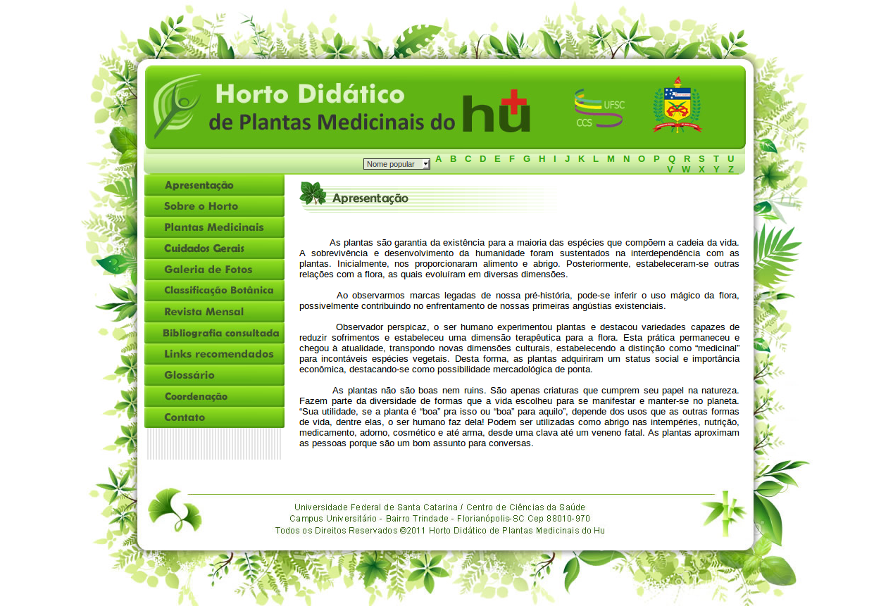
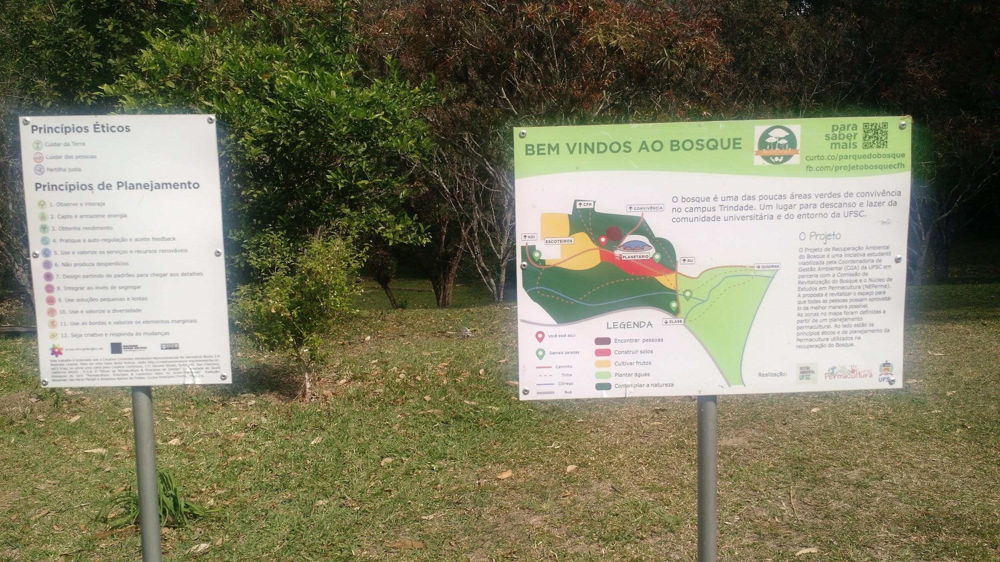
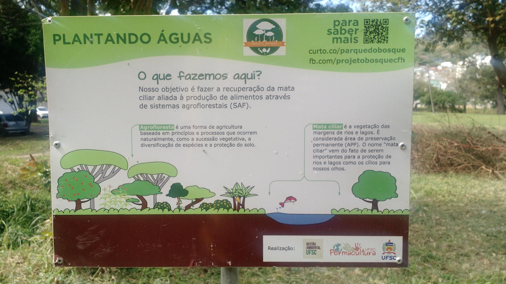
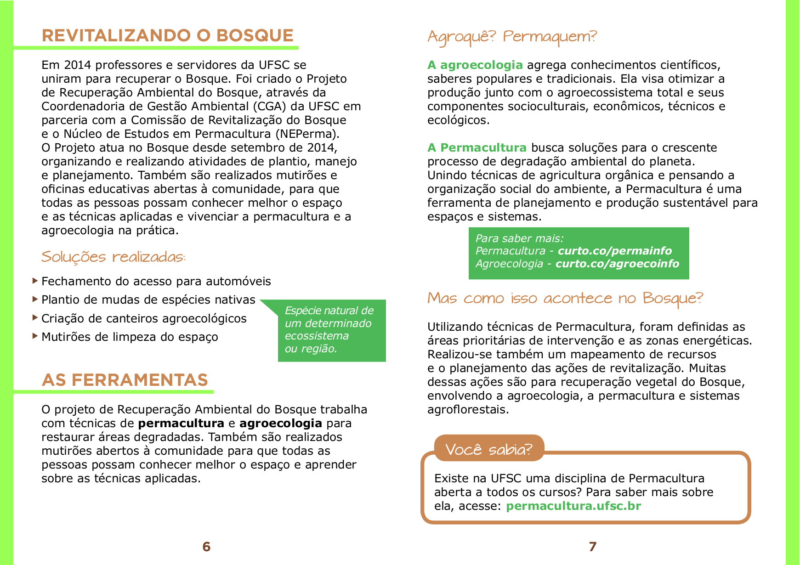
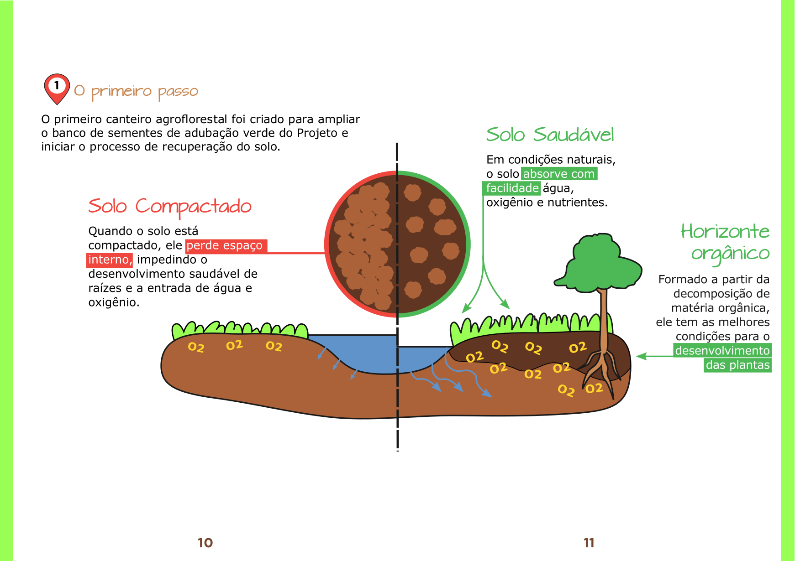
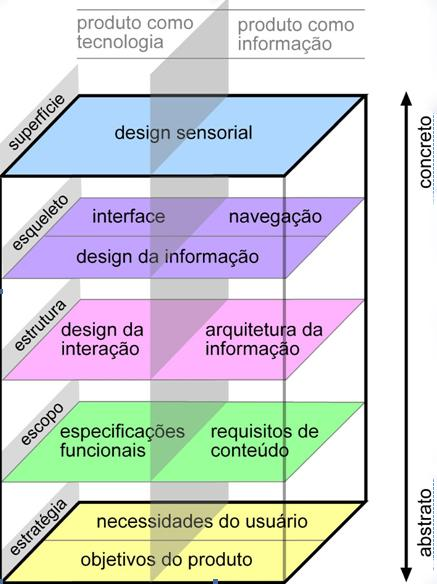

# Introdução

## Apresentação do tema

O uso de plantas como tratamento medicinal é uma prática comum e muito antiga no Brasil, onde uma grande parte da população as utilizam ou como opção única de tratamento ou em associação com medicamentos sintéticos.  Mesmo assim pouco ou nada se fala a respeito disso nos meios acadêmicos e/ou profissionais da área da saúde. O Horto Didático de Plantas Medicinais da UFSC (neste trabalho referido como Horto Medicinal) foi criado junto ao Hospital Universitário, em 1999, com a proposta de ser um espaço aberto à comunidade interessada no estudo, formação e informação sobre o uso das plantas pela população e também de servir como laboratório e espaço didático para o ensino e a pesquisa sobre plantas medicinais dentro da UFSC. O Horto Medicinal está pautado em diversas políticas e programas que regulamentam e incentivam o uso de plantas medicinais e fitoterápicos como opção de tratamento tais como: o Programa Nacional de Plantas Medicinais e Fitoterápicos[1]; a Política Nacional de Práticas Integrativas e Complementares no SUS[2]; a Comissão de Práticas Integrativas e Complementares da secretaria municipal de saúde de Florianópolis[3]. Como forma de divulgar o conhecimento produzido, o Horto Medicinal possui um _website_ ([https://hortomedicinaldohu.ufsc.br/](https://hortomedicinaldohu.ufsc.br/)) com informações sobre o Horto e sobre plantas medicinais.

_Site atual do Horto Medicinal_

_Arquivo do autor_

No website é possível acessar uma base de dados com informações sobre uso popular, ações farmacológicas, contra indicações, interações medicamentosas, reações adversas, fotos e nomes populares diversos de cada planta. Atualmente esta base de dados conta com 220 plantas. No entanto, a formatação do website não é adequada à leitura, tornando-se uma barreira no acesso à informação. Esta inadequação é decorrente, principalmente, da falta de manutenção da estrutura da página que, desde a sua criação, não foi atualizada em relação a novas tecnologias de desenvolvimento web que surgiram neste período.

A _web_ é uma mídia extremamente dinâmica. Primeiro porque está em um processo constante e intenso de transformação devido à grande participação dos usuários na sua construção; segundo porque há uma grande diversidade de suportes para a sua visualização: computadores, Tvs, celulares, _tablets_ etc. Assim, conteúdos que estão dispostos na rede precisam ser constantemente reformados para que se adequem  às novas técnicas, suportes e públicos que surgem o tempo todo. Estudar mídias e organizar informações nela é uma prática de design gráfico.

Portanto, o design gráfico pode ser aplicado no contexto do Horto Medicinal na organização da informação disponibilizada pelo Horto. Esta organização pode tomar a forma de uma cartilha ou guia impresso, uma campanha de cartazes de propaganda, um portfólio impresso ou digital, entre outras. Dentre estas possibilidades, a alternativa vista como mais viável é a construção de um novo _website_. A escolha se justifica principalmente pela necessidade de constante atualização do conteúdo, revisões bibliográficas e novas pesquisas ocorrem constantemente e estas informações precisam ser atualizadas. O meio digital oferece esta possibilidade de atualização com mais agilidade e menos trabalho em relação às outras alternativas. Também é possível citar a relação custo/benefício desta escolha; por tratar-se de mídia digital, não há custos com a produção ou impressão do material. Por fim, há o alcance do material para além das barreiras físicas, podendo ser acessado em qualquer lugar e ponto do mundo com acesso à internet.

Tendo em vista o Horto Medicinal como um serviço de interesse público, acadêmico e popular, apoiado por iniciativas nacionais e municipais; a existência de uma base de dados extensa em constante atualização; e a organização dessa informação em meio digital como alternativa mais adequada e viável, o projeto busca responder a seguinte pergunta: como organizar e apresentar, de forma adequada e acessível ao público, as informações contidas no _website_ do Horto Medicinal?

## Objetivos

### Objetivo geral

Desenvolver a estrutura, _layout_, e _styleguide_ de um _website_ para organizar as informações do Horto Medicinal.

### Objetivos específicos

* Mapear o conteúdo que será veiculado no site.

* Identificar o público-alvo.

* Descrever alternativas similares de sites.

* Pesquisar alternativas em software livre.

* Adequar a tipografia e demais elementos gráficos à identidade visual do Horto medicinal e ao público alvo.

* Documentar as soluções gráficas e estruturais em um _styleguide_.

## Justificativa

Desde o início da do período de graduação, o autor esteve interessado pela atuação que o designer pode ter junto a ações de preservação, proteção e educação ambiental. Por isso trabalhou com grupos da UFSC e de fora que realizam estudos sobre temas como a permacultura, a agroecologia e plantas alimentícias e medicinais da agrobiodiversidade.

Dentro da UFSC, o autor cursou a disciplina optativa Introdução à Permacultura (GCN7938). HOLMGREN(2013, p. 33) define a permacultura como o uso do pensamento sistêmico e de princípios de design para o planejamento de paisagens produtivas a partir de padrões e relações encontradas na natureza, ou seja, uma ciência que une design, produção de recursos renováveis e preservação ambiental. Após a disciplina, o autor passou a atuar como voluntário no Núcleo de Estudos em Permacultura (NEPerma) para cumprir a disciplina de estágio obrigatório. O trabalho foi  vinculado ao projeto de Recuperação Ambiental do Bosque do CFH em que desenvolveu-se uma cartilha digital sobre o projeto e placas informativas para o espaço do bosque.

_Placas no bosque da UFSC projetadas durante estágio obrigatório._

_Fonte: arquivo do autor_

_Spreads de material informativo desenvolvido durante estágio obrigatório._

_Fonte: arquivo do autor_

No ano seguinte (2017) o autor participou na escrita de um projeto de extensão, no qual atuou como bolsista, para auxiliar com a comunicação de projetos de extensão ambiental. Os projetos escolhidos foram o Núcleo de Educação Ambiental da UFSC (NEAmb) e o Horto Medicinal, para os quais foram criadas identidades visuais. A construção do novo site do Horto Medicinal será uma das aplicações desta identidade é uma forma de ampliar a sua comunicação.

_Logotipo da identidade visual desenvolvida durante o projeto de extensão._

_Fonte: arquivo do autor_

Além de ser uma forma de concretizar os estudos e práticas realizadas pelo autor durante a graduação, o projeto é de interesse para futuras pesquisas e práticas pois visa integrar e atender as necessidades de públicos com necessidades distintas: profissionais da área da saúde,  pessoas leigas no assunto buscando auto-tratamento ou informações adicionais sobre um tratamento prescrito e também pesquisadores de diversas áreas com interesse em plantas medicinais.

Também vale ressaltar que para este projeto serão avaliados e utilizados sempre que possível _softwares_ livres em detrimento dos proprietários. De acordo com a_ Free Software Foundation_[4], para ser livre o software precisa atender a quatro liberdades:

* _A liberdade de executar o programa como você desejar, para qualquer propósito (liberdade 0)._

* _A liberdade de estudar como o programa funciona, e adaptá-lo às suas necessidades (liberdade 1). Para tanto, acesso ao código-fonte é um pré-requisito._

* _A liberdade de redistribuir cópias de modo que você possa ajudar ao próximo (liberdade 2)._

* _A liberdade de distribuir cópias de suas versões modificadas a outros (liberdade 3)._

A mesma fundação também afirma que "_Usar _software_ livre é tomar uma decisão política e ética que garante o direito de aprender e compartilhar com outras pessoas o que é aprendido. _Software_ livre tornou-se a fundação de uma sociedade de aprendizado em que o conhecimento é compartilhado de forma que outros possam criar a partir deste conhecimento e aproveitar-se dos benefícios_." [5]

A partir desta perspectiva, pode-se entender o software livre como ideal para a atividade de pesquisa, pois facilita àqueles que queiram reproduzir a metodologia deste projeto o acesso a esses softwares, porque indivíduos e grupos interessados em desenvolvimento e/ou adaptação dos _softwares_ podem encontrar na pesquisa uma documentação precisa e detalhada do seu uso em projetos de design e porque os resultados da avaliação dos softwares quanto a sua adequação a atividade projetual poderão ser enviados diretamente aos desenvolvedores para implementar as alterações cabíveis em futuras versões dos programas.

Outra contribuição deste trabalho à pesquisa acadêmica é a descrição das soluções encontradas na adequação ao meio digital de uma base de dados imagética e textual sobre plantas medicinais, que poderá servir como fundamento para trabalhos semelhantes. A organização de um site sobre plantas medicinais também se apoia em uma perspectiva social. Ele facilita o acesso à informação sobre plantas medicinais através da internet, um meio de grande alcance em relação às mídias físicas, a profissionais que atendam pessoas fazendo uso de plantas ou que desejem receitar plantas como forma de tratamento; também para que pessoas sem acesso a medicamentos industrializados possam fazer uso seguro e informado de plantas medicinais.

A ampliação do acesso à informação sobre plantas medicinais pode ser explicada como uma extensão do alcance de serviços públicos e gratuitos. O Horto Medicinal enquanto espaço aberto à sociedade ganhará visibilidade dentro e fora da UFSC. Também irá estender a abrangência  de programas nacionais e municipais de práticas integrativas e uso de plantas nos órgãos públicos de saúde.

## Metodologia

Tratando-se este de um projeto que busca uma solução em meio digital, será utilizada a metodologia proposta por Jesse James Garrett em seu livro _"The Elements of User Experience" _(2002)[6].

Garret (2002) ressalta, para além das questões funcionais e estética, a importância da experiência de usuário no desenvolvimento do projeto. Ao projetar para o meio digital, esta importância ganha mais peso por tratar-se de um meio de alta complexidade e que não tem um manual de instruções. O uso acontece baseado apenas em experiências anteriores do usuário.

Um _website_ com projeto centrado no usuário é fundamental para garantir que as informações e funcionalidades sejam apresentadas de de forma que os usuários possam compreendê-las com facilidade.

Em Garret (2002) o autor propõe uma metodologia que divide o projeto em cinco etapas ou planos centrados na experiência de usuário. Estes planos se sobrepõem de forma que o mais abstrato fique em baixo e o mais concreto em cima, conforme demonstrado na figura 7.

_strutura metodológica proposta por Garrett._

_Adaptado de Garret(2002)_

Com esta organização sequencial, o autor reforça a dependência de planos superiores aos inferiores. Por exemplo: o plano de esqueleto não pode ser dado por terminado enquanto os planos de estratégia, escopo e estrutura não estiverem definidos e finalizados. Também é importante ressaltar, conforme descrito na página 24, que a atividade em cada plano não é exclusiva e que decisões em uma etapa podem afetar tanto as etapas de coma quanto as de baixo, o importante é que elas sejam _finalizadas_ de baixo para cima.

No projeto do site do Horto medicinal aqui proposto, o **plano de estratégia**, composto pelas necessidades do usuário e objetivos do produto, consistirá da criação de um _briefing_ a partir da introdução do projeto, a construção de personas e suas respectivas jornadas de usuário a partir de entrevistas com o público-alvo e da análise de soluções estéticas e funcionais já existentes em site similares.

Para o **plano de escopo**, será feito o levantamento e organização de todo o conteúdo a ser veiculado no site e será realizada a listagem das funcionalidades, páginas e seções necessárias à veiculação do conteúdo.

No **plano da estrutura**, será criado o mapa do site a partir da relação de navegação das páginas e funcionalidades, quais as possibilidades de transitar no site de uma página a outra criando um mapa do site. Também será descrita a interação usuário-produto, como o site responde às ações realizadas pelo usuário.

O **esqueleto** será composto por protótipos de baixa fidelidade que possam ser utilizados em testes com usuários para saber qual a melhor disposição e organização dos elementos funcionais na tela.

A camada de **superfície** levará em conta os aspectos estéticos dos elementos dispostos no esqueleto. Nesta etapa serão feito todos os ajustes e acabamentos necessários a partir da identidade visual do Horto Medicinal e da análise de soluções similares.
