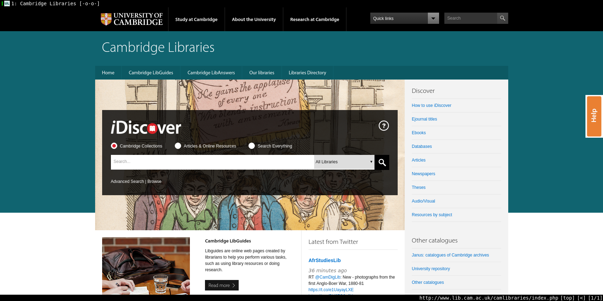
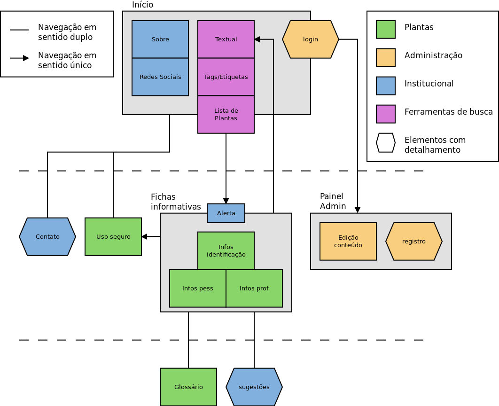
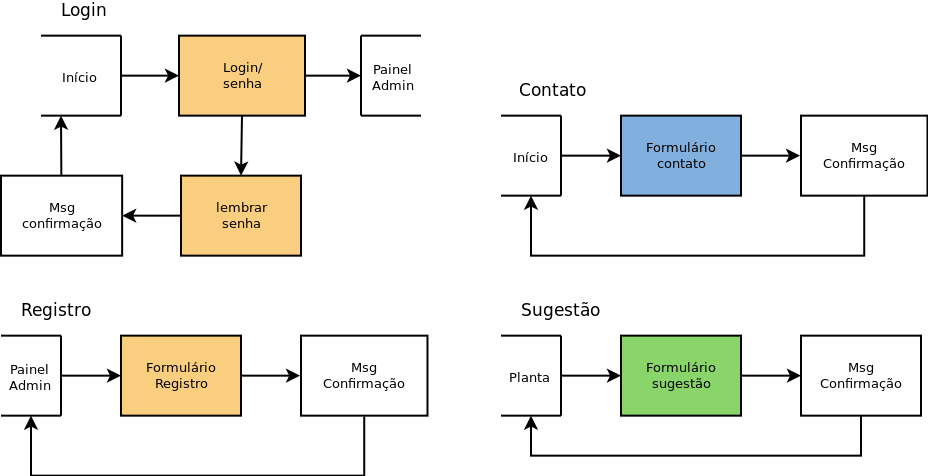

# Plano de estrutura l[plano-de-estrutura]

c[garret02] define o plano de estrutura como o início da tomada de decisões que irão definir os aspectos visuais e informacionais do _site_. Este plano está dividido em duas sessões distintas: o **design de interação**, em que será estudada e definida a interação do usuário com o _site_, e a **arquitetura da informação**, que trata de como a informação é disposta para o usuário. Neste trabalho as duas etapas foram realizadas em paralelo pois se influenciam de forma recíproca.

## Design de interação l[dsn-interacao]

Nesta etapa o autor propõe a criação de um modelo conceitual e um sistema de tratamento de erros. O modelo conceitual deve ser baseado em elementos familiares aos usuários e que tenham relação com o tipo de _site_ que está sendo construído. Como exemplo são mencionados o carrinho de compras, bastante comum em lojas virtuais, e a revista ou jornal, que são bastante referenciados em sites de notícias. O tratamento de erros tem a função de garantir uma boa experiência de usuário ao utilizar o produto desenvolvido, ele é organizado em três momentos: prevenção, correção e recuperação.

### Modelo conceitual l[mod-conceitual]

A criação de um modelo conceitual do _site_ do Horto do HU iniciou com uma análise de duas referências da sessão r[analise-de-similares]: Memorial Sloan Kettering Cancer Center (MSKCC) e National Center for Complementary and Integrative Health (NCCIH).

O MSKCC, por tratar-se de um hospital, emula virtualmente a recepção do usuário no mesmo. Frases dirigidas diretamente ao usuário como pode ser observado na figura XX e telas que se alternam sequencialmente vão oferecendo os serviços da instituição. Ao acessar diferentes partes do _site_ a linguagem continua sendo dirigida ao usuário que é guiado como se estivesse passando por alas do hospital para encontrar o serviço desejado. O _layout_ também é receptivo, utilizando fotos e blocos de cor para preencher as telas.

O NCCIH é o setor do governo estadunidense que trata de práticas integrativas e complementares e seu _site_ tem a estrutura de um catálogo de serviços ou material informacional institucional. Os dizeres são na 1a pessoa do plural, sempre referentes ao próprio NCCIH. A navegação é bastante simples com poucos níveis de hierarquia, sempre dois ou três apenas. O _layout_ com fundo branco e blocos de texto/imagem remete à aparência de um informativo impresso ou um jornal.

Para o projeto tema deste trabalho, por este ter como principal função ser um repositório de informação para consulta, decidiu-se por um modelo conceitual de biblioteca. O usuário poderá acessar o _site_, fazer uma consulta ao acervo e obter as informações que lhe são interessantes sem auxílio de outra pessoa.

A partir deste modelo conceitual, o autor utilizou _sites_ de bibliotecas brasileiras e extrangeiras como referência para a construção deste projeto. As bibliotecas públicas pesquisadas, Biblioteca Nacional, Biblioteca de Nova York e Biblioteca de Londres, pouco acrescentaram pois suas páginas tinha a função de um painel de avisos sobre atividades culturais do museu e não focavam em mecanismos de busca no seu acervo. Para este estudo as bibliotecas universitárias se mostraram muito mais interessantes por colocar a busca como principal <??> dos seus _sites_.

Nas figuras ref[bu-cuny], ref[bu-camb], ref[bu-ufpr], o menu superior, quando presente, diz respeito às universidades; desta forma o conteúdo das bibliotecas fica hierarquicamente dentro da informação de suas respectivas universidades. Nas três figuras também é possível notar o destaque dado á ferrramenta de pesquisa, ela encontra-se no topo das páginas e com margens grandes que ajudam a destacá-la. Todas as buscas podem ser feitas de forma geral ou por dados específicos das obras como título, autor etc. O restante das páginas é composto por links para serviços da bibilioteca e uma seção de notíciascom estrutura semelhante à de  um blog.

") l[bu-cuny]

 l[bu-camb]

") l[bu-ufpr]

Os resultados de busca são exibidos em páginas distintas dos portais das bibliotecas pois são gerenciados por sistemas diferentes. Os títulos encontrados são organizados em fichas horizontais com a imagem da obra e infomrações que auxiliem na identificação da mesma. Esta forma de organização já foi analizada na sessão ref[analise-de-tendencias] Análise de Tendências, item ref[youtube---busca]. A página de resultados também oferece opções de busca avançada a partir de informações como data, língua da publicação etc.

<++ img da busca>

### Tratamento de erros l[trt-erros]

O tratamento de erros do _site_ do Horto do HU foi dividido em duas áreas principais: erros decorrentes da busca textual e erros decorrentes do preenchimento de formulários no site; ambas serão tratadas segundo a sequência de prevenção, correção e recuperação.

Na busca textual, a situação de erro que ocorre é a busca não retornar resultados a partir dos termos utilizados. Para a prevenção desse tipo de erro, será utilizado um texto curto indicando que a busca é sobre plantas, sintomas e doenças. Em caso de erro, é possível indicar erros de digitação e termos popularmente pesquisados para a correção. A recuperação será realizada através de links para categorias de pesquisa (_tags_) e retorno para a página inicial; também continuará disponível o campo de busca para novas tentativas.

No preenchimento de formulários, os erros podem ocorrer por preenchimento incorreto ou não preenchimento de algum campo. A prevenção deste tipo de erro será a indicação clara do que deve ser preenchido em cada campo e de quais campos são obrigatórios. Em caso de erro, o usuário é levado de volta à página do formulário com os campos que necessitam de alteração em destaque para que sejam corrigidos. A recuperação será realizada com um link para cancelar o preenchimento e retornar à página anterior ou página inicial do _site_

## Arquitetura da informação l[arq-informacao]

Segundo c[garret02], a arquitetura da informação trata das formas de organização do conteúdo em seções, páginas e componentes, todos representados por nós. Nesta etapa será produzido um diagrama indicando a relação entre os nós do _site_ e o caminho do usuário entre eles. 

Para a organização utilizou-se a técnica de _cardsorting_ em que os nós são representados por cartões e apresentados a pessoas que correspondem aos perfis de público-alvo para que os organizem. As diferentes organizações registradas são analisadas para a construção da arquitetura final da página.

As informações do _site_ foram organizadas de duas formas: **categorias** e **seções**. As categorias classificam e agrupam as informações em relação ao seu conteúdo, as seções as agrupam levando em conta a navegação: quais informações estarão em uma mesma tela ou área do site.

As categorias criadas são _plantas_, _institucional_, _administração_ e _ferramentas de busca_. _Plantas_ é a principal categoria deste projeto, nela estão reunidas as informações sobre identificação, uso pessoal e profissional e o glossário. _Ferramentas de bsuca_ agrupa três diferentes mecanismos para acessar as informações sobre plantas: busca textual, _tags_ ou etiquetas temáticas com sintomas e ações farmacológicas e por fim uma lista completa das plantas de acordo com seu nome científico. Em _institucional_ estão as informações ligadas diretamente ao Horto Medicinal: sobre o Horto, contato e redes sociais, orientações para o uso seguro, formulário de sugestões e um alerta indicando que o _site_ é apenas para fins informativos e que não substitui auxílio profissional. A categoria _administração_ reúne as páginas e ferramentas dedicadas à gestão do conteúdo e dos administradores do _site_.

Para agrupar as informações em blocos de navegação foram definidas três seções: _Início_, _Fichas informativas_ e _Painel Administrativo_. O início funciona como a entrada do site, ele contém informações sobre o Horto Medicinal, suas redes sociais, as ferramentas de busca e um campo para login administrativo; ela está ligada diretamente às páginas de contato e uso seguro. Através das ferramentas de busca ela leva à seção de _fichas informativas_ que abre com o alerta de finalidade do _site_, contém as informações de identificação das plantas, seu uso pessoal, uso profissional e leva às páginas de glossário, uso seguro e ao formulário de sugestões. O _painel administrativo_ é acessado a partir do campo de login na página inicial e contém ferramentas para registro de novos administradores e edição de conteúdo.

