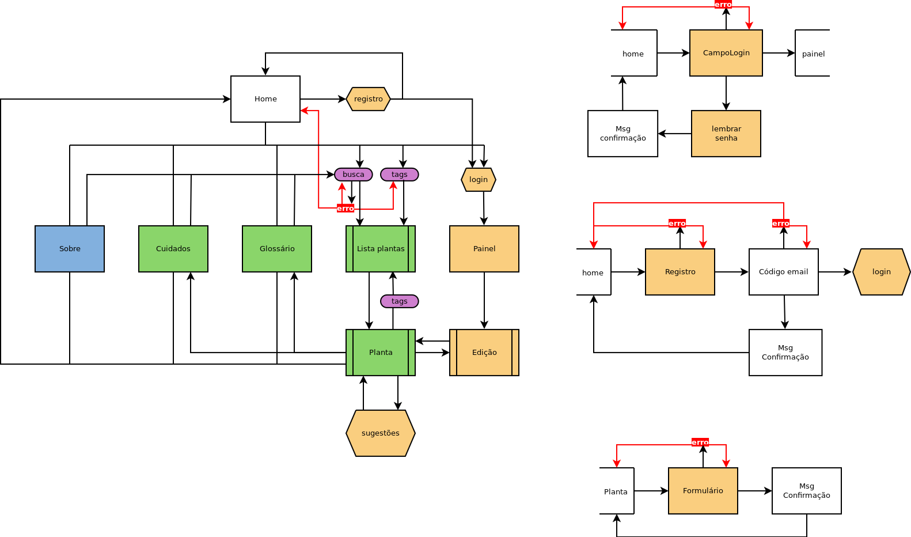
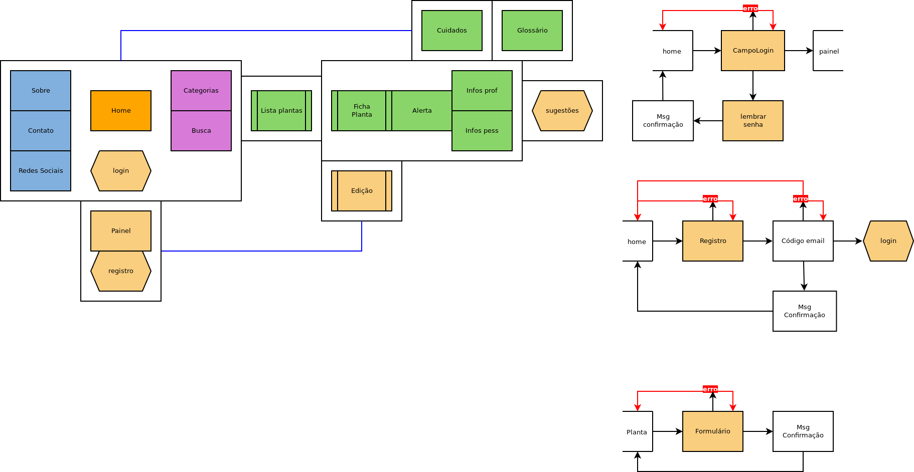

# Plano de estrutura l[plano-de-estrutura]

c[garret02] define o plano de estrutura como o início da tomada de decisões que irão definir os aspectos visuais e informacionais do _site_. Este plano está dividido em duas sessões distintas: o **design de interação**, em que será estudada e definida a interação do usuário com o _site_, e a **arquitetura da informação**, que trata de como a informação é disposta para o usuário. Neste trabalho as duas etapas foram realizadas em paralelo pois se influenciam de forma recíproca.

## Design de interação l[dsn-interacao]

Nesta etapa o autor propõe a criação de um modelo conceitual e um sistema de tratamento de erros. O modelo conceitural deve ser baseado em elementos familiares aos usuários e que tenham relação com o tipo de _site_ que está sendo construído. Como exemplo são mencionados o carrinho de compras, bastante comum em lojas virtuais, e a revista ou jornal, que são bastante referenciados em sites de notícias. O tratamento de erros tem a função de garantir uma boa experiência de usuário ao utilizar o produto desenvolvido, ele é organizado em três momentos: prevenção, correção e recuperação.

### Modelo conceitual l[mod-conceitual]

A criação de um modelo conceitual do _site_ do Horto do HU iniciou com uma análise de duas referências da sessão r[analise-de-similares]: Memorial Sloan Kettering Cancer Center (MSKCC) e National Center for Complementary and Integrative Health (NCCIH).

O MSKCC, por tratar-se de um hospital, emula virtualmente a recepção do usuário no mesmo. Frases dirigidas diretamente ao usuário como pode ser observado na figura XX e telas que se alternam sequencialmente vão oferecendo os serviços da instituição. Ao acessar diferentes partes do _site_ a linguagem continua sendo dirigida ao usuário que é guiado como se estivesse passando por alas do hospital para encontrar o serviço desejado. O layout também é receptivo, utilizando fotos e blocos de cor para preencher as telas.

O NCCIH é o setor do governo estadunidense que trata de práticas integrativas e complementares e seu _site_ tem a estrutura de um catálogo de serviços ou material informacional institucional. Os dizeres são na 1a pessoa do plural, sempre referentes ao próprio NCCIH. A navegação é bastante simples com poucos níveis de hierarquia, sempre 2 ou 3 apenas. O layout com fundo branco e blocos de texto/imagem remete à aparência de um informativo impresso ou um jornal.

Para o projeto tema deste trabalho, por este ter como principal função ser um repositório de informação para consulta, decidiu-se por um modelo conceitual de biblioteca. O usuário poderá acessar o _site_, fazer uma consulta ao acervo e obter as informações que lhe são interessantes sem auxílio de outra pessoa. O caminho deve ser simples e explícito.<++> 

### Tratamento de erros l[trt-erros]

O tratamento de erros do _site_ do Horto do HU foi dividido em duas áreas principais: erros decorrentes da busca textual e erros decorrentes do preenchimento de formulários no site; ambas serão tratadas segundo a sequência de prevenção, correção e recuperação.

Na busca textual, a situação de erro que ocorre é a busca não retornar resultados a partir dos termos utilizados. Para a prevenção desse tipo de erro, será utilizado um texto curto indicando que a busca é sobre plantas, sintomas e doenças. Em caso de erro, é possível indicar erros de digitação e termos popularmente pesquisados para a correção. A recuperação será realizada através de links para categorias de pesquisa (_tags_) e retorno para a página inicial; também continuará disponível o campo de busca para novas tentativas.

No preenchimento de formulários, os erros podem ocorrer por preenchimento incorreto ou não preenchimento de algum campo. A prevenção deste tipo de erro será a indicação clara do que deve ser preenchido em cada campo e de quais campos são obrigatórios. Em caso de erro, o usuário é levado de volta à página do formulário com os campos que necessitam de alteração em destaque para que sejam corrigidos. A recuperação será realizada com um link para cancelar o preenchimento e retornar à página anterior ou página inicial do _site_

## Arquitetura da informação l[arq-informacao]

Segundo c[garrett02], a arquitetura da informação trata das formas de organização do conteúdo em seções, páginas e componentes, todos representados por nós. Nesta etapa será produzido um diagrama indicando a relação entre os nós do _site_ e o caminho do usuário entre eles. 

Para a organização utilizou-se a técnica de _cardsorting_ em que os nós são representados por cartões e apresentados a pessoas que correspondem aos perfis de público-alvo para que os organizem. As diferentes organizações registradas são analisadas para a construção da arquitetura final da página.

As informações do _site_ foram organiadas em 4 categorias: institucional, ferramentas de busca, informações sobre plantas, e administrativo. Estas informações ficaram organizadas em três grandes seções: página inicial, planta, painel administrativo; além de páginas auxiliares ou de acesso.

A seção da página inicial contém as ferramentas para a busca de plantas, informações institucionais do Horto, acesso à área administrativa, uma ligação para a página de cuidados gerais no uso de plantas e outra para o formulário de contato do horto. A sessão de plantas é acessada através das ferramentas de busca e inicia sempre com uma mensagem informando que os conteúdos dispostos no _site_ são informativos e não substituem auxílio profissional, esta seção contém a ficha da planta, com as informações para identificação correta, informações para uso pessoal e para uso profissional. Também possui ligações para o formulário de sugestões, o glossário e para a página de cuidados gerais. Na área administrativa encontram-se a função de cadastrar novo usuário e de editar o conteúdo do _site_.
