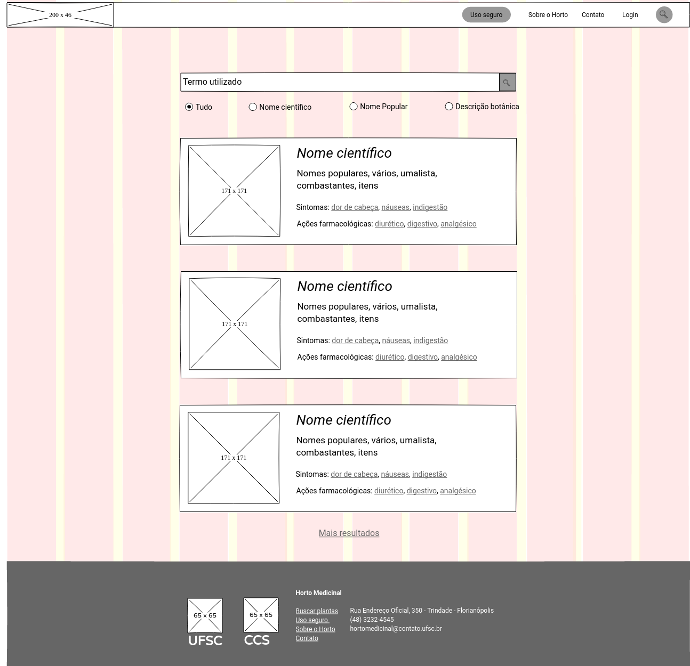
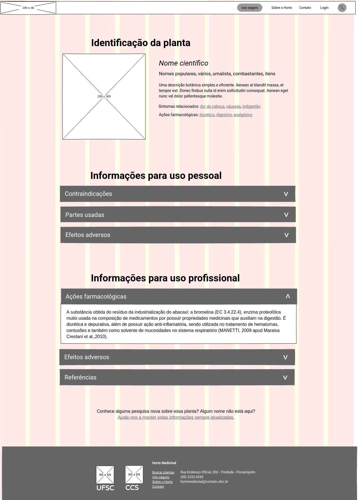

# Plano de esqueleto l[plano-de-esqueleto]

Em c[garret02] o plano de esqueleto é descrito como a etapa em que traduzimos o acúmulo conceitual das etapas nteriores em protótipos de baixa e média fidelidade, organizando os elementos na página.

## Grid

Para iniciar a estruturação do _layout_, foi criado um grid com 1280px de largura, 12 colunas de 92px (7,18%) e _gutter_ de 16px (1,25%). Este grid se adapta de forma proporcional em telas menores e mantém a largura de 1280px em telas maiores. Idealmente este layout funciona em telas com largura mínima de 768px, para dispositivos mais estreitos é necessário desenvolver um grid específico com colunas e medidas diferenciadas. Conforme mencionado no item ref[delimitacoes], este trabalho não tem a intenção de desenvolver uma versão para dispositivos com telas mais estreitas que 768px. Para este trabalho serão estruturadas a página inicial, os resultados das buscas e a ficha de plantas por entender que são os itens mais importantes e mais complexos do _site_.

O grid não tem a função de encaixar todas os elementos de cada página, mas sim de auxiliar na criação de layouts com diferentes números de colunas e elementos com a largura padronizada. Elementos podem estar alinhados apenas à esquerda ou a direita, alinhados com o centro da página e estar alinhados com margens em relação às colunas do grid.

Para a construção do grid, dos _wireframes_ e dos protótipos de baixa fidelidade para testes de usabilidade foi utilizado o _software_ Pencil, desenvolvido e distribuído sob os termos da _GNU Public License version 2_ (http://www.gnu.org/licenses/gpl-2.0.html <++> incluir na bib), caracterizando-o como _software_ livre.

## Página inicial

 l[wire-inicio]

Na figura ref[wire-inicio] está disposto o wireframe da página inicial completa do _site_. Ela contém os mecanismos de busca, _link_ para informações sobre o Horto Medicinal e _links_ para rede social e contato. O menu superior e o rodapé são fixos para todas as páginas subsequentes.

No menu há o _link_ para uso seguro de plantas destacado pois a equipe gesetora do Horto entende ser uma informação fundamental e que deve ser de fácil acesso; no _site_ inteiro ela está em um local fixo e também aparece quando necessário nas paginas de fichas das plantas. O _link_ Sobre o Horto leva à respectiva página. O _link_ contato leva à área da página inicial em que estão o _email_ e a rede social do Horto Medicinal. O link _login_ leva à área administrativa do derenciador de conteúdo. Por fim, um ícone de lupa que expande para um campo de busca permitindo realizar uma nova busca com facilidade a partir de um ponto qualquer do _site_.

O rodapé reúne informações adicionais como endereço e telefone, uma  lista das páginas do site e _links_ para os _sites_ da UFSC e do CCS.

## Resultado das buscas

## Ficha de planta

