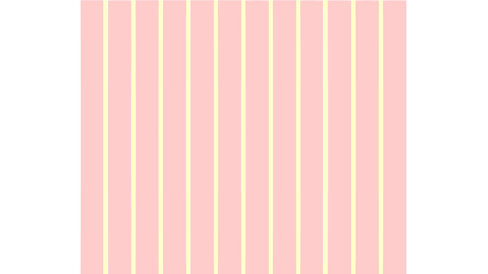
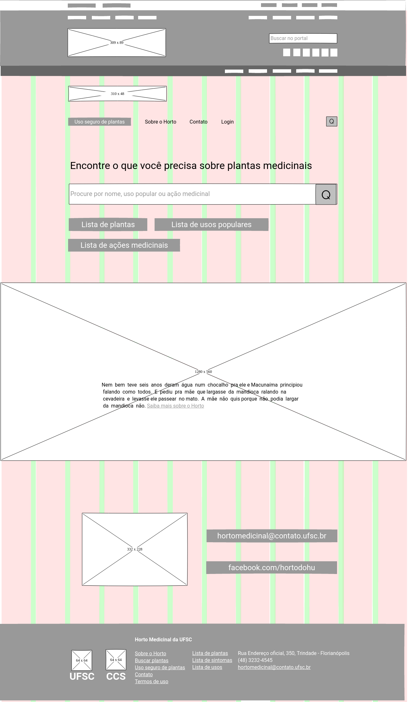
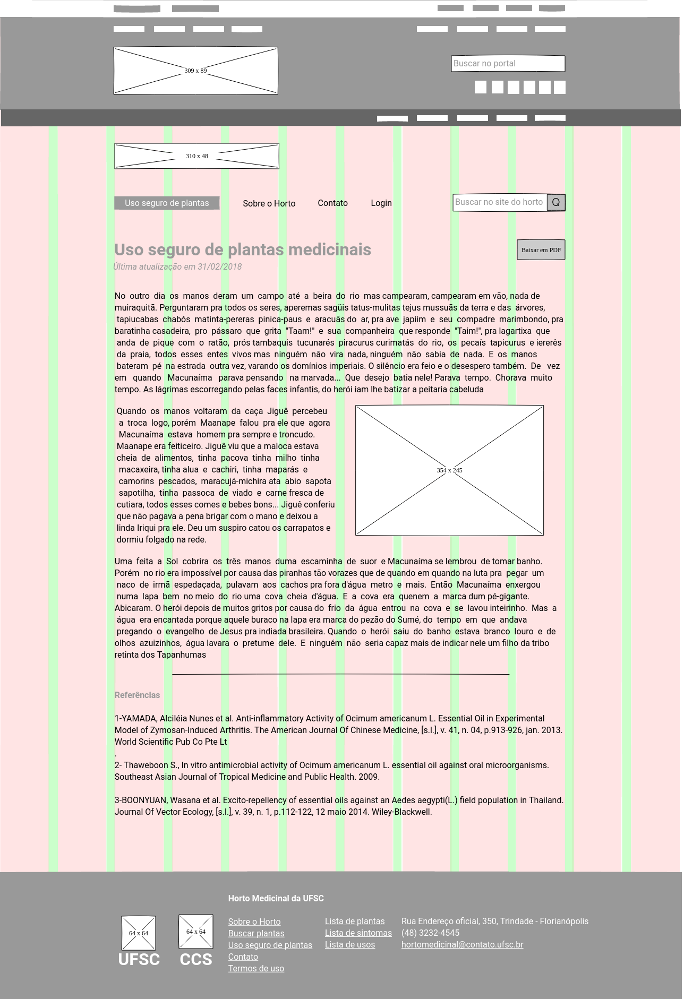
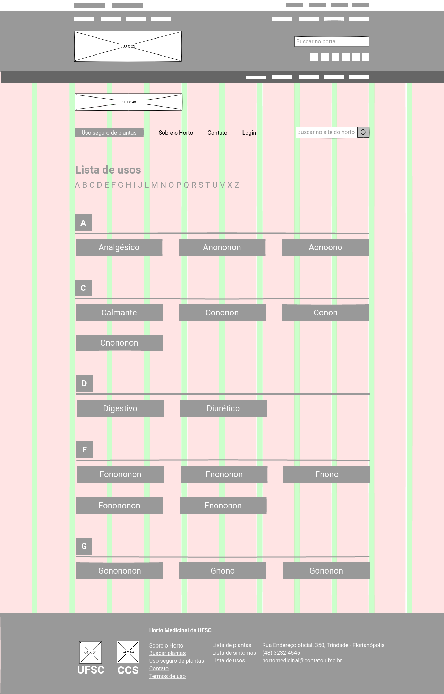
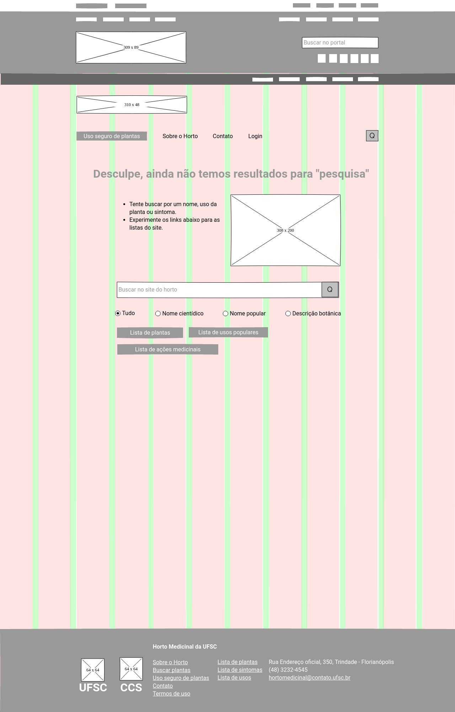
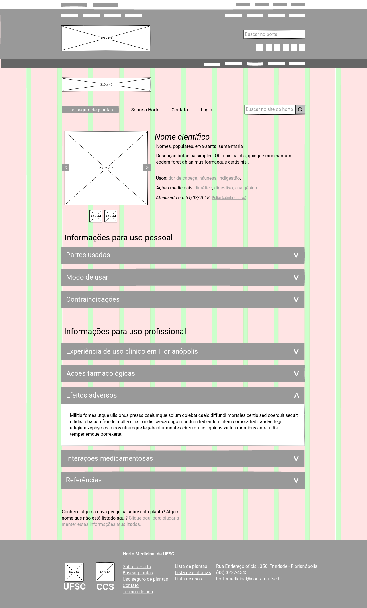
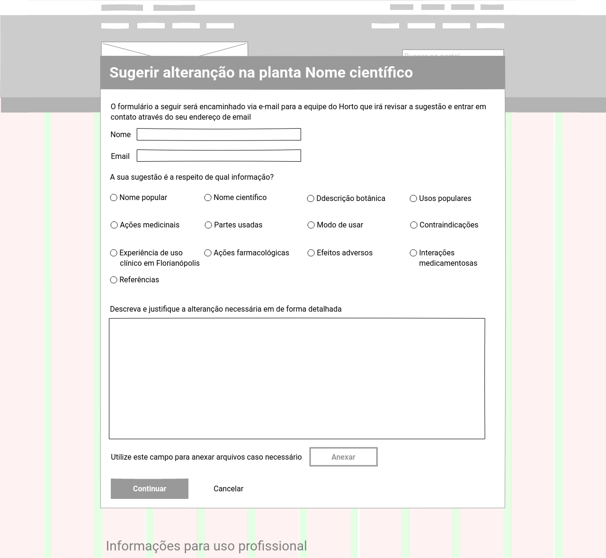
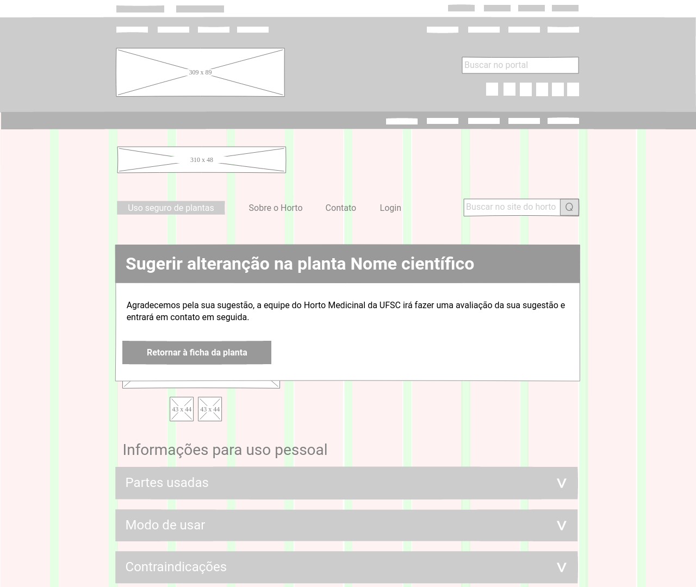
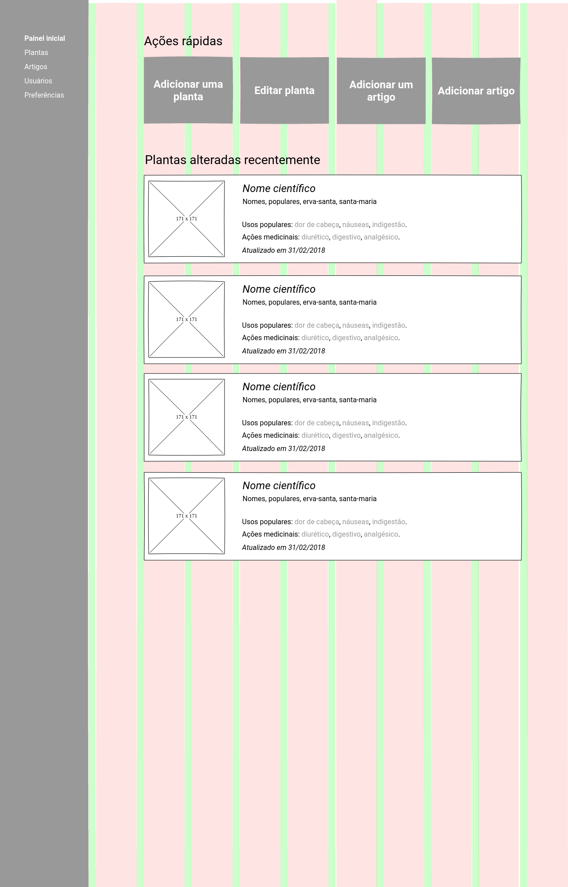

# Plano de esqueleto l[plano-de-esqueleto]

Em c[garret02] o plano de esqueleto é descrito como a etapa em que traduzimos o acúmulo conceitual das etapas anteriores em protótipos de baixa e média fidelidade, organizando os elementos na página. Para este trabalho, serão desenvolvidos XX modelos de página em duas categorias distintas. Na categoria _usuário final_ estarão as páginas inicial, artigo, etiquetas, resultados da busca, erro de busca, ficha da planta, termo legal, ficha da planta e formulário de sugestão. Na categoria _ferramentas administrativas_ estarão as páginas de painel administrativo, lista de plantas publicadas e edição de fichas das plantas.

## Grid

Para iniciar a estruturação do _layout_, foi criado um grid com 1280px de largura, 12 colunas de 92px (7,18%) e _gutter_ de 16px (1,25%). Este grid se adapta de forma proporcional em telas menores e mantém a largura de 1280px em telas maiores. Idealmente este layout funciona em telas com largura mínima de 768px, para dispositivos mais estreitos é necessário desenvolver um grid específico com colunas e medidas diferenciadas. Conforme mencionado no item ref[delimitacoes], este trabalho não tem a intenção de desenvolver uma versão para dispositivos com telas mais estreitas que 768px. Para este trabalho serão estruturadas a página inicial, os resultados das buscas e a ficha de plantas por entender que são os itens mais importantes e mais complexos do _site_.

O grid não tem a função de encaixar todas os elementos de cada página, mas sim de auxiliar na criação de layouts com diferentes números de colunas e elementos com a largura padronizada. Elementos podem estar alinhados apenas à esquerda ou a direita, alinhados com o centro da página e estar alinhados com margens em relação às colunas do grid.

Para a construção do grid, dos _wireframes_ e dos protótipos de baixa fidelidade para testes de usabilidade foi utilizado o _software_ Pencil, desenvolvido e distribuído sob os termos da _GNU Public License version 2_ (http://www.gnu.org/licenses/gpl-2.0.html <++> incluir na bib), caracterizando-o como _software_ livre.

## Páginas para o usuário final

++Incluir prints de outras verãos do esqueleto

### Elementos fixos

As páginas serão compostas por dois cabeçalhos e um rodapé fixos e corpos de conteúdo diferentes em cada tela. 

O primeiro cabeçalho é o cabeçalho padrão do _site_ da UFSC, como o horto está vinculado à universidade e estará dentro do domínio .ufsc.br, entendeu-se necessária a inclusão dete cabeçalho. O segundo cabeçalho contém a logo do horto na primeira linha e o menu principal na segunda. A logo  leva sempre à página inicial. O primeiro item do menu, uso seguro de plantas, fica destacado pois é uma seção bastante referenciada nas fichas de plantas e <++> contém informações importantes para o usuário, principalmente o público que faz uso pessoal de plantas medicinais. O ícone de busca à direita expande para um campo de busca; quando não há outro campo de busca no corpo da página, o campo do ícone fica expandido por padrão.

O rodapé contém uma logo da UFSC que leva à sua página principal, um mapa do _site_ e informações para contato.

### Página inicial

A página inicial é composta por três áreas distintas, ferramentas de busca, resumo sobre o Horto e contato. Nas ferramentas de busca há um campo textual destacado e _links_ auxiliares que levam às listas de plantas, usos populares e ações medicinais. Em seguida, o resumo sobre o horto é constituído por uma foto que ocupa toda a largura da tela com um resumo e um link para o artigo **Sobre o horto**. Por fim, o contato é composto por um _link_ para a rede social do Horto e outro para o endereço de email.

 l[wire-inicio]

### Artigo

O modelo _artigo_ será utilizado para comportar textos longos como **sobre o HOrto** e **uso seguro de plantas**. Ele é composto de um tótulo destacado, um botão para download em PDF do artigo, o corpo de texto e imagens e uma sessão com as referências citadas e eventuais _links_ para as mesmas.

### Etiquetas

o modelo de _etiquetas_ irá organizar as listas de **usos populares** e **ações medicinais**. As etiquetas com as palavras-chave ficarão dispostas em ordem alfabética e separadas por linhas horizontais de acordo com a letra inicial, um alfabeto no topo da página auxiliará na navegação. Cada etiqueta levará a uma lista com as plantas marcada com a palavra-chave contida.

### Resultado das buscas

O _resultado das buscas_ pode ser acessado de três diferentes formas, a partir de uma busca textual, de uma etiqueta ou do link para a **lista de plantas**. Nos dois primeiros casos, os resultados são filtrados pelo termo buscado ou pela etiqueta, no terceiro todas as plantas cadastradas são listadas.
No topo da tela há um campo para novas bucas e opções para busca avançada. Os resultados são mostrados em _cards_ com uma foto, nome científico, nomes populares, usos populares, ações medicinais e data da última atualização desta informação.

### Erro na busca

O modelo _erro na busca_ é utilizado para situações em que a busca textual não retorna resultados. Ela apresenta uma mensagem no topo alertando sobre o erro; abaixo estão um campo de busca com opções avançadas e _links_ para as listas de usos populares, ações medicinais e plantas para o usuário poder tentar uma nova busca.

### Termo legal

Esta tela aparecerá sempre que o usuário acessar uma _ficha de planta_. Ele contém um texto isentando o Horto legalmente do uso indevido de plantas medicinais. Para diversas pesquisas recorrentes em um único uso, uma caixa pode ser marcada para que essa mensagem não seja mostrada até o final do acesso ao _site_.

### Ficha de planta

A _ficha de planta_ está dividida em informações para identificação da planta, informações para uso pessoal e informações para uso profissional. Na área de identificação da planta, a organização e o conteúdo se assemelham bastante aos _cards_ do _resultado das buscas_, funcionando como uma confirmação visual de que a ficha acessada corresponde à planta desejada; as diferenças são adição de mais fotos da planta que podem ser acessadas em um sistema de _slides_ e o acréscimo de um pequeno texto com a descrição botânica das plantas. As áreas de informação pessoal e profissional estão organizadas em diferentes tópicos que podem ser expandidos revelando o seu conteúdo, este sistema facilita a navegação na tela pois permite ver mais tópicos de uma só vez.

### Sugestão

O formulário de sugestão tem a função de ser um canal de colaboração dos usuários para manter o _site_ sempre atualizado. Para identificação do usuário é pedido nome, email e profissão; uma lista de botões de opção permite o usuário indicar sobre qual informação é a sua contribuição, que é descrita em um campo de texto. Também há um campo não obeigatório de anexo de arquivos.

## Ferramentas administrativas

### Elementos fixos

Como elemento fixo das ferramentas administrativas há um menu lateral com _links_ para o painel, listas de plantas e artigos publicados, gerenciamento de usuários e preferências do _site_.

### Painel administrativo

O _painel administrativo_ é acessado a partir do _login_ no segundo cabeçalho das páginas para o suário final, funcionando com página inicial das ferramentas administrativas. Na parte superior há botões para as ações mais recorrentes de adicionar e editar artigos ou fichas de planta. Em seguida está uma lista com as plantas recentemente atualizadas na forma de _cards_ semelhantes aos _resultados da busca_.

###
