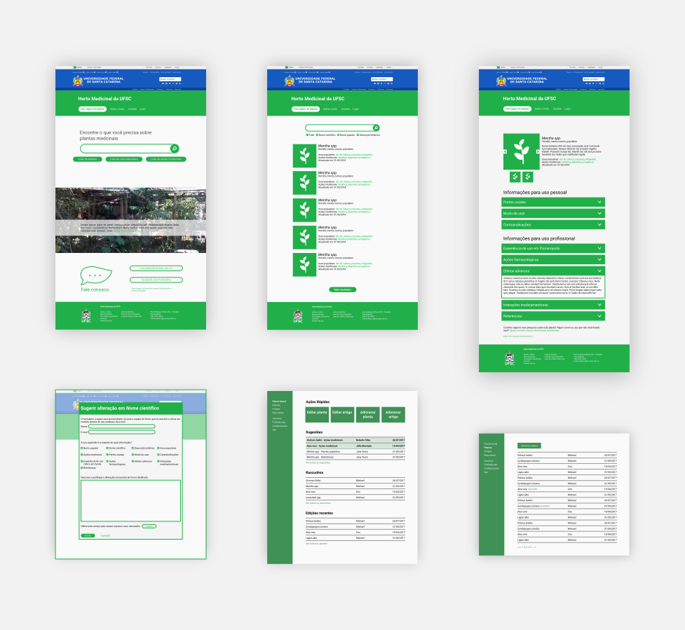

# Testes de usabilidade

Antes de iniciar a etapa final do projeto, o plano de superfície, foram realizados testes de usabilidade para validar a disposição dos _layouts_ no plano de esqueleto com usuários em potencial do site. Para estes testes as situações hipotéticas apresentadas no item XX jornadas de usuário foram adapatadas a um formato de narrativa para ajudar na imersão das pessoas nas situações apresentadas. As telas também foram reformuladas para aproximar-se mais de uma página _web_ esteticamente; em diálogo com a orientadora do projeto, entendeu-se a importância dessa reformulação para que a estética dos _wireframes_ não se tornasse um ruído durante os testes.

## Seleção dos participantes

A seleção de participantes ocorreu de forma que se encontrasse ao menos uma pessoa que se aproximasse de cada perfil criado na sessão XX Personas, ainda assim houve algumas variações. No total foram quatro participantes contemplando os três diferentes públicos-alvo: grupo pessoal grupo profissional e administradores. A persona XX, Márcia, foi representada por uma mulher, professora universitária da faixa etária de 41 a 55 anos. A persona XX, Fernanda, foi representada por um homem estudante das fases finais de medicina com idade entre 25 e 32 anos. A persona XX, (ADMIN_NOME), foi representada por um homem estudante de farmácia, atual corresponsável pela atualização das informações do _site_ do Horto Medicinal com idade entre 25 e 32 anos. Também realizou-se testes com um homem estudante de engenharia e idade entre 18 e 24 anos que, apesar de não se encaixar em nenhuma das personas, contempla o público-alvo de uso pessoal das plantas.

## Preparação dos testes

Para facilitação dos testes, o autor cumpriu as funções necessárias: disponibilizar o equipamento, orientar o usuário, ler a narrativa de cada uma das tarefas, 

## Descrição das tarefas

### Buscar uma planta a partir de sintomas - grupo pessoal

Este teste foi realizado com as quatro pessoas por entender que todas fazem uso pessoal independentemente de outros usos do _site_. A tarefa consistia em encontrar uma planta a partir de sintomas característicos de gripe. Todas as pessoas completaram a tarefa sem maiores dificuldades. Uma acessou a lista de usos populares, duas acessaram a lista de plantas e uma acessou o campo de busca. Todas descreveram os termos utilizados para as listas como confusos ou imprecisos, foi proposta uma alteração para _lista de sintomas_ e _lista de usos_.

### Enviar uma sugestão através do formulário - grupo profissional

Esta tarefa foi realizada pelas pessoas que são estudantes ou profisisonais da área da saúde. Pediu-se que o usuário encontrasse o formulário de sugestões e enviasse uma sugestão através dele. Um usuário não encontrou o formulário, procurando-o na área de contato. Outro disse só ter encontrado por que na narrativa apresentada foi mencionado que a sugestão era sobre uma planta específica. Em função destes ocorridos, decidiu-se por apresentar na área de contato um botão para os formulários e adicionar ao formulário um campo para seleção da planta.

### Editar uma ficha de planta - administradores

Esta tarefa foi proposta às pessoas corresponsáveis pela atualização das informações no _site_ do horto. Pediu-se aos usuários que acessacem o painel administrativo do site e editassem a ficha de uma planta. Todas as pessoas puderam completar a tarefa sem dificuldades.

## Comentários e observações (Que nome colocar??)

Após realizadas as tarefas o facilitador dialogou com os usuários coletando comentários e também registrou algumas alterações necessárias após observar terceiros interagindo com a página. A lista a seguir resume as alterações necessárias de forma semelhante à descrita na seção XX plano de escopo

* Incluir no menu superior um link ou botão explícito para a página inicial.
* Reduzir a altura do menu superior pois estava ocupando espaço dos conteúdos específicos de cada página e dificultando sua visualização.
* Inclusão de ícones para indicar o nível de estudos disponíveis para cada planta, Tanto para a quantidade de informação disponível quanto para indicar se foram obtidas com testes _in vitro_, em animais ou em humanos.
