# Introdução

## Apresentação do tema

O uso de plantas como tratamento medicinal é uma prática comum e muito antiga no Brasil, onde uma grande parte da população as utilizam ou como opção única de tratamento ou em associação com medicamentos sintéticos.  Mesmo assim pouco ou nada se fala a respeito disso nos meios acadêmicos e/ou profissionais da área da saúde. O Horto Didático de Plantas Medicinais da UFSC (neste trabalho referido como Horto Medicinal) foi criado junto ao Hospital Universitário, em 1999, com a proposta de ser um espaço aberto à comunidade interessada no estudo, formação e informação sobre o uso das plantas pela população e também de servir como laboratório e espaço didático para o ensino e a pesquisa sobre plantas medicinais dentro da UFSC. O Horto Medicinal está pautado em diversas políticas e programas que regulamentam e incentivam o uso de plantas medicinais e fitoterápicos como opção de tratamento tais como: o Programa Nacional de Plantas Medicinais e Fitoterápicos[1]; a Política Nacional de Práticas Integrativas e Complementares no SUS[2]; a Comissão de Práticas Integrativas e Complementares da secretaria municipal de saúde de Florianópolis[3]. Como forma de divulgar o conhecimento produzido, o Horto Medicinal possui um _website_ ([https://hortomedicinaldohu.ufsc.br/](https://hortomedicinaldohu.ufsc.br/)) com informações sobre o Horto e sobre plantas medicinais.

_Arquivo do autor_

No website é possível acessar uma base de dados com informações sobre uso popular, ações farmacológicas, contra indicações, interações medicamentosas, reações adversas, fotos e nomes populares diversos de cada planta. Atualmente esta base de dados conta com 220 plantas. No entanto, a formatação do website não é adequada à leitura, tornando-se uma barreira no acesso à informação. Esta inadequação é decorrente, principalmente, da falta de manutenção da estrutura da página que, desde a sua criação, não foi atualizada em relação a novas tecnologias de desenvolvimento web que surgiram neste período.

A _web_ é uma mídia extremamente dinâmica. Primeiro porque está em um processo constante e intenso de transformação devido à grande participação dos usuários na sua construção; segundo porque há uma grande diversidade de suportes para a sua visualização: computadores, Tvs, celulares, _tablets_ etc. Assim, conteúdos que estão dispostos na rede precisam ser constantemente reformados para que se adequem  às novas técnicas, suportes e públicos que surgem o tempo todo. Estudar mídias e organizar informações nela é uma prática de design gráfico.

Portanto, o design gráfico pode ser aplicado no contexto do Horto Medicinal na organização da informação disponibilizada pelo Horto. Esta organização pode tomar a forma de uma cartilha ou guia impresso, uma campanha de cartazes de propaganda, um portfólio impresso ou digital, entre outras. Dentre estas possibilidades, a alternativa vista como mais viável é a construção de um novo _website_. A escolha se justifica principalmente pela necessidade de constante atualização do conteúdo, revisões bibliográficas e novas pesquisas ocorrem constantemente e estas informações precisam ser atualizadas. O meio digital oferece esta possibilidade de atualização com mais agilidade e menos trabalho em relação às outras alternativas. Também é possível citar a relação custo/benefício desta escolha; por tratar-se de mídia digital, não há custos com a produção ou impressão do material. Por fim, há o alcance do material para além das barreiras físicas, podendo ser acessado em qualquer lugar e ponto do mundo com acesso à internet.

Tendo em vista o Horto Medicinal como um serviço de interesse público, acadêmico e popular, apoiado por iniciativas nacionais e municipais; a existência de uma base de dados extensa em constante atualização; e a organização dessa informação em meio digital como alternativa mais adequada e viável, o projeto busca responder a seguinte pergunta: como organizar e apresentar, de forma adequada e acessível ao público, as informações contidas no _website_ do Horto Medicinal?

## Objetivos

### Objetivo geral

Desenvolver a estrutura, _layout_, e _styleguide_ de um _website_ para organizar as informações do Horto Medicinal.

### Objetivos específicos

* Mapear o conteúdo que será veiculado no site.

* Identificar o público-alvo.

* Descrever alternativas similares de sites.

* Pesquisar alternativas em software livre.

* Adequar a tipografia e demais elementos gráficos à identidade visual do Horto medicinal e ao público alvo.

* Documentar as soluções gráficas e estruturais em um _styleguide_.

## Justificativa

Desde o início da do período de graduação, o autor esteve interessado pela atuação que o designer pode ter junto a ações de preservação, proteção e educação ambiental. Por isso trabalhou com grupos da UFSC e de fora que realizam estudos sobre temas como a permacultura, a agroecologia e plantas alimentícias e medicinais da agrobiodiversidade.

Dentro da UFSC, o autor cursou a disciplina optativa Introdução à Permacultura (GCN7938). HOLMGREN(2013, p. 33) define a permacultura como o uso do pensamento sistêmico e de princípios de design para o planejamento de paisagens produtivas a partir de padrões e relações encontradas na natureza, ou seja, uma ciência que une design, produção de recursos renováveis e preservação ambiental. Após a disciplina, o autor passou a atuar como voluntário no Núcleo de Estudos em Permacultura (NEPerma) para cumprir a disciplina de estágio obrigatório. O trabalho foi  vinculado ao projeto de Recuperação Ambiental do Bosque do CFH em que desenvolveu-se uma cartilha digital sobre o projeto e placas informativas para o espaço do bosque.

_Fonte: arquivo do autor_

_Fonte: arquivo do autor_

No ano seguinte (2017) o autor participou na escrita de um projeto de extensão, no qual atuou como bolsista, para auxiliar com a comunicação de projetos de extensão ambiental. Os projetos escolhidos foram o Núcleo de Educação Ambiental da UFSC (NEAmb) e o Horto Medicinal, para os quais foram criadas identidades visuais. A construção do novo site do Horto Medicinal será uma das aplicações desta identidade é uma forma de ampliar a sua comunicação.

_Fonte: arquivo do autor_

Além de ser uma forma de concretizar os estudos e práticas realizadas pelo autor durante a graduação, o projeto é de interesse para futuras pesquisas e práticas pois visa integrar e atender as necessidades de públicos com necessidades distintas: profissionais da área da saúde,  pessoas leigas no assunto buscando auto tratamento ou informações adicionais sobre um tratamento prescrito e também pesquisadores de diversas áreas com interesse em plantas medicinais.

Também vale ressaltar que para este projeto serão avaliados e utilizados sempre que possível _softwares_ livres em detrimento dos proprietários. De acordo com a _Free Software Foundation_ XX, para ser livre, o software precisa atender a quatro liberdades:

* _A liberdade de executar o programa como você desejar, para qualquer propósito (liberdade 0)._

* _A liberdade de estudar como o programa funciona, e adaptá-lo às suas necessidades (liberdade 1). Para tanto, acesso ao código-fonte é um pré-requisito._

* _A liberdade de redistribuir cópias de modo que você possa ajudar ao próximo (liberdade 2)._

* _A liberdade de distribuir cópias de suas versões modificadas a outros (liberdade 3)._

A mesma fundação também afirma que "_Usar_ software _livre é tomar uma decisão política e ética que garante o direito de aprender e compartilhar com outras pessoas o que é aprendido._ Software _livre tornou-se a fundação de uma sociedade de aprendizado em que o conhecimento é compartilhado de forma que outros possam criar a partir deste conhecimento e aproveitar-se dos benefícios._" [5]

A partir desta perspectiva, pode-se entender o software livre como ideal para a atividade de pesquisa, pois facilita àqueles que queiram reproduzir a metodologia deste projeto o acesso a esses softwares, porque indivíduos e grupos interessados em desenvolvimento e/ou adaptação dos _softwares_ podem encontrar na pesquisa uma documentação precisa e detalhada do seu uso em projetos de design e porque os resultados da avaliação dos softwares quanto a sua adequação a atividade projetual poderão ser enviados diretamente aos desenvolvedores para implementar as alterações cabíveis em futuras versões dos programas.

Outra contribuição deste trabalho à pesquisa acadêmica é a descrição das soluções encontradas na adequação ao meio digital de uma base de dados imagética e textual sobre plantas medicinais, que poderá servir como fundamento para trabalhos semelhantes. A organização de um site sobre plantas medicinais também se apoia em uma perspectiva social. Ele facilita o acesso à informação sobre plantas medicinais através da internet, um meio de grande alcance em relação às mídias físicas, a profissionais que atendam pessoas fazendo uso de plantas ou que desejem receitar plantas como forma de tratamento; também para que pessoas sem acesso a medicamentos industrializados possam fazer uso seguro e informado de plantas medicinais.

A ampliação do acesso à informação sobre plantas medicinais pode ser explicada como uma extensão do alcance de serviços públicos e gratuitos. O Horto Medicinal enquanto espaço aberto à sociedade ganhará visibilidade dentro e fora da UFSC. Também irá estender a abrangência  de programas nacionais e municipais de práticas integrativas e uso de plantas nos órgãos públicos de saúde.

## Metodologia

Tratando-se este de um projeto que busca uma solução em meio digital, será utilizada a metodologia proposta por Jesse James Garrett em seu livro _"The Elements of User Experience" _(2002)[6].

Garret (2002) ressalta, para além das questões funcionais e estética, a importância da experiência de usuário no desenvolvimento do projeto. Ao projetar para o meio digital, esta importância ganha mais peso por tratar-se de um meio de alta complexidade e que não tem um manual de instruções. O uso acontece baseado apenas em experiências anteriores do usuário.

Um _website_ com projeto centrado no usuário é fundamental para garantir que as informações e funcionalidades sejam apresentadas de de forma que os usuários possam compreendê-las com facilidade.

Em Garret (2002) o autor propõe uma metodologia que divide o projeto em cinco etapas ou planos centrados na experiência de usuário. Estes planos se sobrepõem de forma que o mais abstrato fique em baixo e o mais concreto em cima, conforme demonstrado na figura 7.

_Adaptado de Garret(2002)_

Com esta organização sequencial, o autor reforça a dependência de planos superiores aos inferiores. Por exemplo: o plano de esqueleto não pode ser dado por terminado enquanto os planos de estratégia, escopo e estrutura não estiverem definidos e finalizados. Também é importante ressaltar, conforme descrito na página 24, que a atividade em cada plano não é exclusiva e que decisões em uma etapa podem afetar tanto as etapas de coma quanto as de baixo, o importante é que elas sejam _finalizadas_ de baixo para cima.

No projeto do site do Horto medicinal aqui proposto, o **plano de estratégia**, composto pelas necessidades do usuário e objetivos do produto, consistirá da criação de um _briefing_ a partir da introdução do projeto, a construção de _personas_ e suas respectivas jornadas de usuário a partir de entrevistas com o público-alvo e da análise de soluções estéticas e funcionais já existentes em site similares.

Para o **plano de escopo**, será feito o levantamento e organização de todo o conteúdo a ser veiculado no site e será realizada a listagem das funcionalidades, páginas e seções necessárias à veiculação do conteúdo.

No **plano da estrutura**, será criado o mapa do site a partir da relação de navegação das páginas e funcionalidades, quais as possibilidades de transitar no site de uma página a outra criando um mapa do site. Também será descrita a interação usuário-produto, como o site responde às ações realizadas pelo usuário.

O **esqueleto** será composto por protótipos de baixa fidelidade que possam ser utilizados em testes com usuários para saber qual a melhor disposição e organização dos elementos funcionais na tela.

A camada de **superfície** levará em conta os aspectos estéticos dos elementos dispostos no esqueleto. Nesta etapa serão feito todos os ajustes e acabamentos necessários a partir da identidade visual do Horto Medicinal e da análise de soluções similares.

# Plano de estratégia

No plano de estratégia serão registrados os objetivos do usuário e as necessidades dos usuários, levantando qual a forma de projetar o _site_ e para quem ele será projetado. Isso se dará através de cinco etapas:

* _Briefing_: É o documento inicial do projeto, construído a partir de pesquisas com os gestores do _site_ e pesquisas preliminares sobre o material existente.

* _Personas_: Sintetização dos perfis de usuários para facilitação do seu entendimento pelo projetista.

* _User Journeys_: Descrição das possibilidades de interação das _personas_ com o _site_. Indica quais ações serão realizadas e quais necessidades essas ações demandam.

* _Análise de similares_: Um levantamento de _site_s com funções semelhantes às do _site_ projetado para analisar soluções já existentes.

* _Análise de referências_: Criação de um painel com _sites_ de diversas áreas para estudo de tendências de caráter estético e organizacional.

## _Briefing_

O _briefing_ é uma ferramenta que descreve as condições e necessidades iniciais de um projeto. Segundo Pazmino (2015, p. 22) não existe um formato ou modelo ideal pré-determinado para o _briefing_, ele deve sintetizar e expressar as características de projeto da melhor forma possível. Para o _site_ do Horto Medicinal, o _briefing_ será dividido em quatro seções principais: **Objetivos do _site_**, em que será definida sua principal função e como ela se relaciona com os diferentes públicos-alvo; a partir dos objetivos serão descritas as **Funções pretendidas** para que se cumpram os objetivos; o **Portfólio atual** irá reunir peças de comunicação já existentes do Horto Medicinal para uma análise da linguagem visual utilizada; por fim, no **_Benchmarking_** será feita uma análise de _sites_ indicados pelos administradores do Horto Medicinal para um melhor entendimento de quais funções são necessárias.

O _briefing_ aqui apresentado foi aplicado no dia 20 de setembro de 2017 com a profa. Maique Biaviatti, do departamento de farmácia da UFSC e atual responsável pelo Horto Medicinal, no formato de entrevista semiestruturada. A síntese do material coletado será apresentada nos itens subsequentes.

### Objetivos do _site_

O principal objetivo do _site_ é servir como um banco de informações acessíveis e confiáveis sobre o uso seguro de plantas medicinais para dois públicos principais com necessidades distintas, listadas a seguir por ordem de importância.

a) **Público leigo.** Pessoas leigas na área da saúde e do uso de plantas. Fazem uso pontual e rápido do _site_ a partir de um sintoma ou enfermidade específicos. Não têm interesse em aprofundar conhecimentos ou realizar estudos mais demorados no _site_. Necessitam de informações precisas e seguras para que possam fazer o uso correto das plantas medicinais.

b) **Profissionais da saúde.** Médicos, enfermeiros, farmacêuticos, dentistas e demais profissionais da área da saúde. Uso do _site_ ligado à atividade profissional, tanto para entender uma planta usada por um paciente quanto para poder indicar plantas como tratamento ou parte dele. Necessitam de boas descrições e imagens para poder fazer a identificação e a receita das plantas assim como informações técnicas referentes à posologia, interações medicamentosas e efeitos adversos. Também atuam como pesquisadores, buscando por informações confiáveis e referenciadas e podendo indicar novas referências para o _site_.

É necessário o entendimento de que não são públicos isolados ou sem relações entre si. Profissionais da saúde(b) podem fazer uso do _site_ a partir de uma demanda profissional originada por um paciente leigo(a). O contrário também pode acontecer: uma pessoa leiga(a) utilizar o _site_ por indicação após uma consulta com um profissional da saúde(b).

### Funções pretendidas

Para atender aos objetivos do _site_ e às demandas do público, entende-se necessárias algumas funcionalidades. Para a consulta de informações sobre o uso de plantas medicinais é necessário estruturas padronizadas organizando estas informações e um sistema de busca que facilite ao usuário encontrar a planta desejada. Esta estrutura deve priorizar e dar destaque aos conteúdos que são fundamentais no uso seguro das plantas: identificação (fotos e descrição botânica), contra-indicações, interações medicamentosas, reações adversas e posologia.

Para a alteração e adição de informações, é preciso estabelecer um canal de comunicação usuário-administrador e torná-la visível e acessível no _site_.

Para as funções administrativas do _site_, é indispensável uma interface que permita realizar alteração de adição de conteúdo sem a necessidade de acessar o código-fonte do _site_, à semelhança de gerenciadores de conteúdo como Wordpress ou Blogspot.

### Portfólio atual

Esta seção é destinada a reunir materiais de comunicação já existentes do Horto Medicinal, buscar padrões gráficos e avaliar seus pontos positivos e negativos.

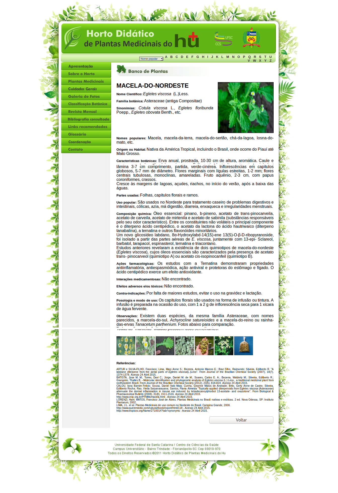

30-09-2017

 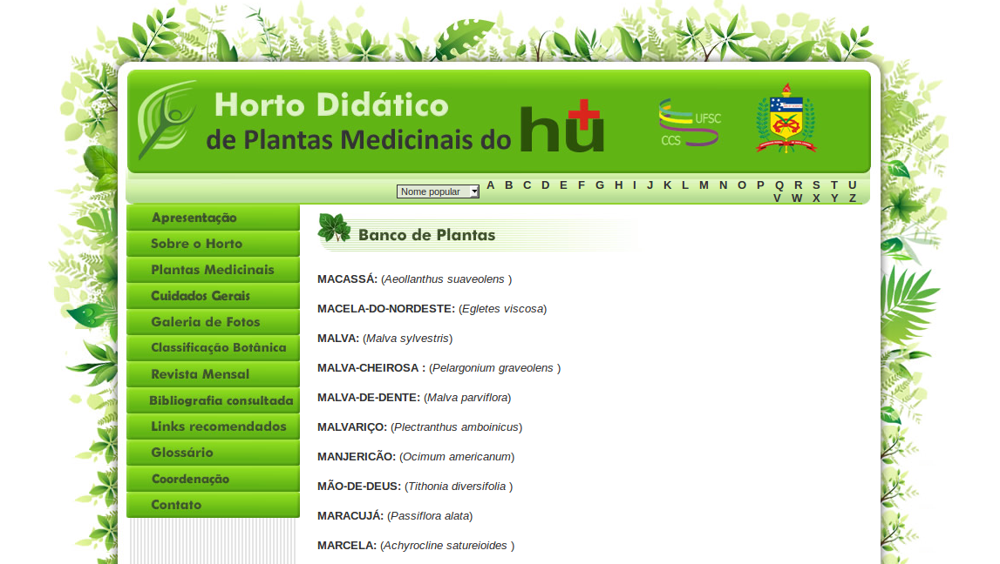

30-09-2017

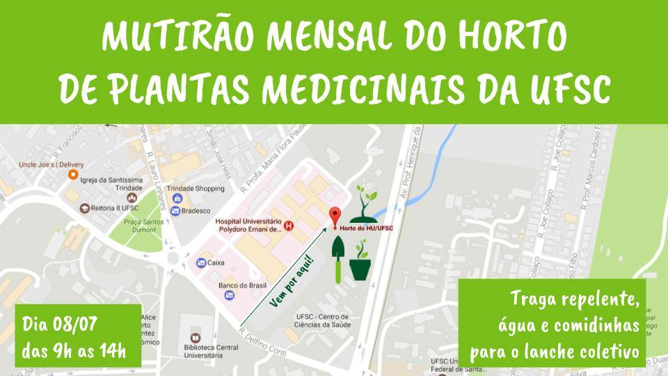

Face horto - 30-09-2017

Por ter sua comunicação visual iniciada muito recentemente, só foi possível coletar uma peça além das capturas de tela do _site_ atual; Até então utilizava-se apenas fotos e outras imagens com fins meramente ilustrativos na sua comunicação. A partir das imagens fica evidente o uso recorrente da cor verde, por estar estreitamente relacionada às ideias de planta e natureza. Fora este elemento, não há a identificação de quaisquer outros padrões de comunicação. Em relação ao _site_ é necessário comentar que não há qualquer tipo de hierarquização da informação gerando muito ruído visual e dificultando muito a leitura.

### _Benchmarking_

Durante a entrevista, foram indicados dois _sites_ como referência de conteúdo e formatação eles serão brevemente apresentados aqui e analisados em maior profundidade na sessão XX Análise de similares.

* _National Center for Complementary and Integrative Health (NCCIH)_ - NCCIH é um departamento do governo estadunidense responsável por pesquisas científicas na área de práticas integrativas complementares. Possui uma sessão sobre plantas medicinais com bastantes informações para pesquisadores da área.
* _Memorial Sloan Kettering Cancer Center (MSKCC)_ - Um importante hospital de tratamento do câncer de Nova Iorque. No seu _site_ há uma sessão sobre uso de plantas medicinais com informações completas.

## Personas

_Persona_ é uma ferramenta utilizada para representar características de um determinado público-alvo. "A palavra [persona] é usada para expressar a ideia de um ser humano que representa um comportamento, e que tem alguma ligação com os outros pela ação ou pelo afeto" (PAZMINO, 2015, p. 110).

A _persona_ consiste em uma pessoa fictícia, ou personagem, que reúne os hábitos, interesses, faixa etária, ocupação, estilo de vida e outros aspectos do público. Para ter efetividade, a _persona_ deve ser estereotipada com características extremas de um determinado público; isso garante que outras pessoas com atributos menos acentuados também sejam atendidas pelo projeto desenvolvido.

Neste trabalho, a criação das _personas_ será feita a partir dos resultados de um questionário _online_ intitulado "Como você busca informações sobre plantas medicinais na _internet_?". Este questionário irá prover dados sobre a idade do público, sua profissão, se buscam informações para uso pessoal ou profissional, quais as principais informações buscadas e quais os principais problemas encontrados na busca. O questionário completo, assim como seus resultados podem ser consultados no final deste trabalho no apêndice A.

### Análise do questionário

O questionário foi realizado com a plataforma _Google forms_ e divulgado através de redes sociais e grupos de discussão de temas relacionados ao estudo e uso de plantas medicinais. As respostas foram recolhidas durante 7 dias, de 7 a 13 de outubro de 2017, nos quais foi possível obter 127 submissões. Os resultados foram analisados em grupos distintos a partir da pergunta 4 do questionário, "Você pesquisa sobre plantas medicinais para uso profissional ou pessoal?", as opções de resposta eram “apenas pessoal”, “apenas profissional” e “profissional e pessoal”.

Como só houve duas respostas afirmando "Apenas profissional" para pergunta 4, foram separados apenas dois grupos: um para as pessoas que fazem apenas uso pessoal das buscas (Grupo Pessoal) e outro para as que fazem uso pessoal e profissional (Grupo Profissional).

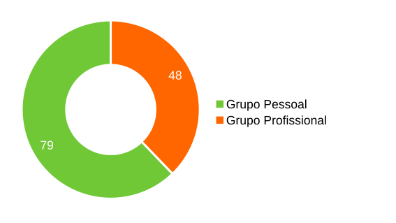

*Fonte: Arquivo do autor.*

Para iniciar a análise deste questionário, é preciso entender que o autor, enquanto estudante universitário, está próximo de uma realidade com pessoas em sua maioria jovens e ligadas a realidade acadêmica; por isso a grande maioria dos resultados apontou um grupo majoritariamente de estudantes entre 18 e 24 anos. Outra explicação para um público com menos idade é tratar-se de busca de informação feita através da _internet_. Por tratar-se de uma tecnologia relativamente nova, pessoas mais jovens tendem a ter mais domínio sobre ela e usar mais corriqueiramente.

Em relação à idade, o Grupo Pessoal apresentou um perfil  médio mais velho em relação ao Grupo Profissional. No Grupo Profissional isso indica que são de uma geração profissional mais nova, sem alguns dos preconceitos em relação às plantas que por muito tempo foram vistas como algo místico ou ineficaz em tratamentos relacionados à saúde. No Grupo Pessoal nota-se que muitas das pessoas são de gerações anteriores à _internet_ e que podem não ter muita familiaridade ou facilidade com o seu uso e interfaces complexas.

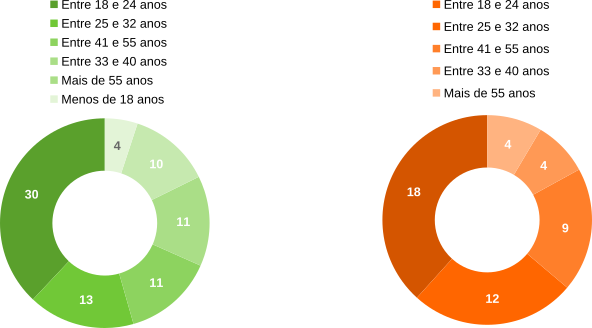

*Fonte: Arquivo do autor*

Outros dados relevantes para a caracterização das _personas_ são a frequência e a duração das pesquisas. Ambos os grupos apresentaram uma maioria que faz pesquisas esporádicas conforme a necessidade e que estas pesquisas duram de 15 a 45 minutos. No entanto, analisando a média das respostas, é possível observar que o Grupo Profissional tende a pesquisar com mais frequência e regularidade e durante períodos mais longos que o Grupo Pessoal. Podemos interpretar essa diferença com uma necessidade profissional de manter-se atualizado em relação ao assunto, pesquisando para além de casos que surgem no dia a dia. Também é perceptível uma maior dedicação a estas pesquisas, verificando fontes e cruzando diferentes dados para poder transmitir informações seguras e embasadas nos momentos de atuação profissional.

*Comparação das frequências de pesquisa.*

*Fonte: Arquivo do autor*

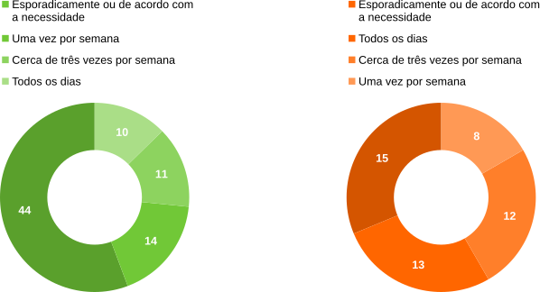

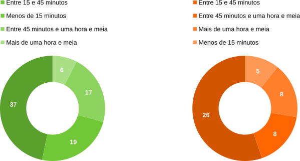

*Fonte: Arquivo do autor*

Quando questionados sobre as fontes de informação, a maioria afirmou consultar _sites_ especializados e blogs sobre o tema. No Grupo Pessoal, há uma distribuição um pouco mais homogênea entre as opções apresentadas do que no Grupo Profissional, aonde a grande maioria (93.75%) afirmou consultar _sites_ especializados e outras opções foram assinaladas entre 60% e 50% das respostas, com exceção dos grupos de e-mail. Isso demonstra que em ambos os grupos há uma preocupação com a confiabilidade da informação, daí a preferência por _sites_ especializados. Também é possível levantar a hipótese de que profissionais a usar mais plataformas de discussão por atuarem também como pesquisadores.

*Fonte: Arquivo do autor*

Em ambos os grupos as informações mais buscadas são a respeito da identificação das plantas e das receitas e posologias. Uma diferença marcante entre os dois grupos é o interesse na toxicidade das plantas. No Grupo Profissional, aproximadamente 60% das pessoas afirmaram pesquisar por plantas tóxicas enquanto no Grupo Pessoal apenas 38% fez a mesma afirmação. Este dado reforça a importância que o Grupo Profissional dá ao uso seguro de plantas, devido principalmente em sua atuação ministrando plantas a terceiros.

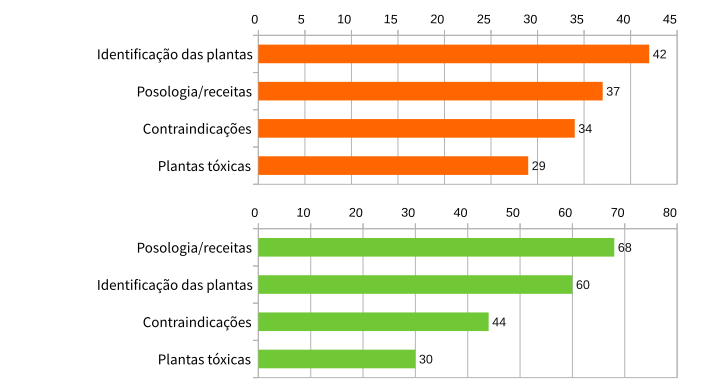

*Fonte: Arquivo do autor*

Na última pergunta, referente às principais dificuldades encontradas durante as pesquisas não houve diferença significativa na respostas dos dois grupos. Os principais problemas assinalados foram a confiabilidade das informações e a identificação correta das plantas, reiterando a necessidade de mostrar o embasamento das informações apresentadas no _site_ do Horto Medicinal e de dar atenção às fotos e descrições botânicas.  Menos afirmadas mas ainda significativas são as respostas referentes a falta de informação e a informações contraditórias encontradas em locais diferentes.

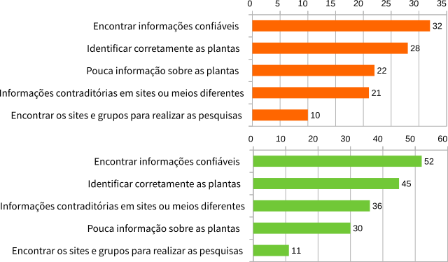

*Fonte: Arquivo do autor*

### Definição das personas

**Márcia - Uso pessoal**

Mulher, 46 anos, professora do fundamental.

* _Relação com as plantas_: Usa para si e para familiares. Usa o _site_ para buscar receitas e identificar corretamente as plantas. Muito do seu tempo livre ela passa cuidando do jardim; fazendo podas, novas mudas, transplantando e observando plantas espontâneas, tem muito interesse nos potenciais medicinal e alimentício das plantas.

* _Estilo de vida_: Nativa da Ilha, filhos na UFSC, tem jardim casa, vai em alguns mutirões do horto, almoços final de semana com a família, viagem nas férias

* _Objetivos no_ site: Resolver problemas pontuais, dor de barriga, cicatrização e cuidados com um machucado, sintomas de resfriado etc. Usa para si e para a família.

* _Informações mais importantes_: Posologia e identificação das plantas

* _Razões para usar a página_: Confiável por ser um _site_ da universidade. Contém uma base de dados vasta e completa.

* _Dificuldades/frustrações_: Busca ineficiente, dificuldade de encontrar plantas a partir dos nomes populares. Excesso de informação ‘monótona’, sem hierarquia ou destaques.

* _Capacidade técnica no uso do_ site: Média

* Sites _que visita_: Grupo das PANCs no facebook, página do Horto Medicinal, blog come-se, blogs em geral.

Márcia faz usos rápidos e pontuais do _site_, por isso precisa que a o caminho para a informação seja fácil de encontrar e percorrer. Ao acessar o conteúdo desejado, as informações de que necessita devem ser lidas e compreendidas sem esforço, precisam estar evidenciadas e sem a presença de outros elementos que possam competir pela atenção da usuária. Também gosta de ver as fotos das plantas para saber se pode encontrá-las em seu jardim.

**Fernanda - Uso profissional**

Mulher, 28 anos, médica do SUS Florianópolis.

* _Relação com as plantas_: Ministra como tratamento ou parte dele do centro de saúde em que trabalha. Há uma horta no local e também cultiva algum as plantas em casa. Faz pesquisas constantes sobre novos estudos para manter-se atualizada. Preocupa-se com informações seguras para passar a seus pacientes.

* _Estilo de vida_: Mutirões nos centros, bicicleta, praia, vegetariana, interesse em carreira acadêmica/pesquisa, solteira, veio de fora da cidade p/ estudar.

* _Objetivos no_ site: Uso para pacientes do centro de saúde em que trabalha. Tanto na busca de terapias quanto para mostrar informações e imagens aos pacientes.

* _Razões para usar a página_: Informações técnicas sobre ações farmacológicas, interações medicamentosas e contra indicações.

* _Dificuldades/frustrações_: Falta de hierarquização das informações no _site_.

* _Capacidade técnica no uso do_ site: Média-alta

* Sites _que visita_: PubMed, MSKCC, bases de dados de hospitais e bases de dados acadêmicas com informações sobre plantas.

Fernanda usa o _site_ com finalidade profissional, por isso necessita que ele seja uma fonte de informações confiáveis que seja possível para ela verificar as fontes destas informações. Também precisa que a divisão entre o conteúdo para o Grupo Pessoal e para o Grupo Profissional esteja bem definida e sinalizada, para que possa saber aonde procurar o que deseja.

**Roberto - Administração do _site_**

Homem, 22 anos, bolsista da área da saúde

* _Relação com as plantas:_ Estudante de farmácia que ficou interessado pelas plantas medicinais após ingressar na UFSC e conhecer o Horto Medicinal. Cultiva algumas plantas em vasos na kitnet em que mora.

* _Estilo de vida:_ Estudante universitário, veio de outra cidade para estudar, mora próximo à universidade, vai nos mutirões dos centros de saúde da cidade e do Horto Medicinal, sia a noite nas festas e bares da universidade, vai à praia e faz trilhas nos finais de semana.

* _Objetivos no _site: Adicionar e alterar informações a partir das sugestões recebidas através do _site_.  

* _Razões para usar a página:_ Realizar a manutenção das informações.

* _Dificuldades/Frustrações:_ Interfaces complicadas e contra-intuitivas, dificuldade para realizar as funções administrativas.

* _Capacidade técnica no uso do _site_:_ Média

* Sites _que visita:_ Facebook, gmail, cagr, moodle

Roberto realiza funções simples e mecânicas no _site_. Ele precisa de ferramentas administrativas que facilitem suas tarefas; um painel de controle que seja intuitivo e que não precise de muito tempo para dominar o seu uso.

## Jornadas de usuário

Com o intuito de prever as ações dos usuários no _site_, é feito um levantamento de objetivos, necessidades, cenário e sequência de ações realizadas durante o uso. Este mapeamento será registrado na forma de jornadas de usuário, uma ferramenta descritiva para facilitar a visualização da informação e a comparação entre diferentes usos e usuários.

Par este trabalho, as jornadas serão divididas em cinco etapas distintas. Na etapa de _necessidade_ serão descritos o cenário e o motivo do uso; a etapa de _acesso ao _site indica como o usuário encontra e acessa o _site_; na _acesso à informação_ é feita a descrição das ações necessárias para que o usuário encontre o conteúdo desejado dentro da página; a _interação_ consiste da interação do usuário com a página após acessar as informações desejadas; por fim, o _final_ descreve quais são as páginas acessadas e as ações realizadas após sanadas as necessidades do usuário.

### Márcia - Casa

* _Necessidade_ - Márcia chegou em casa do trabalho sentindo dores no corpo e o nariz entupido, logo abre o _site_ para buscar plantas que possam aliviar seus sintomas.

* _Acesso ao_ site - Buscando na _internet_ por "Plantas medicinais gripe" encontra o _site_ do horto entre os resultados.

* _Acesso à informação_ - Entrando no _site_, acessa uma lista de _links_ para plantas com a _tag_ "gripe", nela escolhe uma planta que tenha em sua dispensa ou no seu jardim.

* _Interação_ - Na página da planta selecionada, observa as contraindicações para saber se é seguro usar aquela planta, caso haja algum impedimento, volta à página anterior e acessa outra planta.

* _Final_ - A usuária então anota as informações da posologia da planta escolhida e fecha a página .

Nesta jornada observa-se que usuários podem acessar o _site_ em condições bio-psíquicas precárias em função de alguma enfermidade. Por isso é necessário reduzir o ruído visual e utilizar poucos níveis de hierarquia para que a informação seja facilmente encontrada e lida corretamente.

### Fernanda - Consultório

* _Necessidade_ - Durante uma consulta, Fernanda decide por usar uma planta no tratamento que vai receitar ao paciente e utiliza o _site_ para mostrar as informações necessárias.

* _Acesso ao_ site - Acessa diretamente o _site_ a partir de seus favoritos

* _Acesso à informação_ - No _site_, usa o campo de busca e acessa a página da planta desejada.

* _Interação_ - Na página da planta, mostra ao paciente as fotos da planta e o _site_ para que ele possa acessar mais tarde para eventuais dúvidas

* _Final_ - Anota no receituário as informações importantes para o paciente e fecha a página

O uso durante uma consulta precisa que o acesso à planta desejada seja rápido. Para que o paciente possa compreender o que lhe é mostrado e acesse novamente a página em casa, é preciso que o conteúdo seja acessível, mas também é necessário informações técnicas e uma estética científica para que não se perca a confiabilidade do _site_.

### Fernanda - Pesquisa em casa

* _Necessidade_ - Após o expediente, Fernanda acessa o _site_ do horto para estudar o caso de um paciente que marcou uma consulta após apresentar reações negativas ao uso de uma planta

* _Acesso ao_ site - Acessa diretamente o _site_ a partir de seus favoritos

* _Acesso à informação_ - No _site_, usa o campo de busca e acessa a página da planta desejada.

* _Interação_ - Pesquisa nas áreas de reações adversas, interações medicamentosas e contra indicações para saber quais os fatores que podem ter causado as reações no caso que está acompanhando. Acessa também as referências e estudos mencionados quando entende ser necessário aprofundar-se em alguma informação

* _Final_ - Com as informações coletadas, prepara uma lista de perguntas a serem feitas na consulta que podem ajudar a elucidar o caso.

Aqui é demonstrado um uso mais prolongado da página, o que requer soluções que reduzam a fatiga no caso de um uso prolongado. O recorrente acesso às referências também precisa ser facilitado.

### Fernanda - Sugestão

* _Necessidade_ - Durante uma consulta, um paciente disse fazer uso de uma determinada planta. Fernanda anota o nome e o uso para verificar no _site_ do horto. Para facilitar a verificação, Fernanda pede fotos da planta ao paciente.

* _Acesso ao_ site - Fernanda acessa o _site_ a partir da sua lista de favoritos no navegador.

* _Acesso à informação_ - No _site_, a pesquisa por nome popular não deu resultados mas pela foto Fernanda consegue reconhecer a planta e faz a pesquisa diretamente pelo seu nome científico.

* _Interação_ - Na página da planta, utiliza a foto disponível para confirmar a espécie. Em seguida verifica se o uso feito pelo paciente está mencionado. Caso não esteja, faz uma pesquisa em bases de dados por estudos que possam confirmar a ação da planta.

* _Final_ - Fernanda acessa o formulário de sugestões e indica o novo nome popular para a planta e os estudos que encontrou em sua pesquisa.

Para facilitar a sugestão de Fernanda, é importante que esta ação possa ser acessada diretamente na página da planta que está consultando. Um formulário padrão com contato para as sugestões e uma mensagem de confirmação do envio também se fazem importantes neste caso.

### Roberto - Adicionar nova planta

* _Necessidade_ - Uma aluna da área da saúde realizou seu TCC sobre as propriedades farmacológicas de uma planta que ainda não constava na base de dados do Horto Medicinal e enviou seu trabalho à administração do _site_ para que a planta seja incluída

* _Acesso ao_ site - Acesso direto pela lista de favoritos ou pela URL

* _Acesso à informação_ - Na página inicial, Roberto acessa a área de login e entra com usuário e senha.

* _Interação_ - No painel de controle, acessa a opção de adicionar nova planta e entra com o texto já pré-montado nos campos de inserção.

* _Final_ - Após adicionar a planta, acessa a página recém criada para verificar possíveis erros no processo.

A área de login precisa ser acessada com facilidade a partir da tela inicial, mas não pode ofuscar outros conteúdos por tratar-se de um recurso voltado para um tipo muito específico e minoritário de usuário. O caminho entre o modo de edição e visualização do conteúdo precisa ser simples e rápido nos dois sentidos para que a verificação não seja um trabalho cansativo.

### Roberto - Editar conteúdo

* _Necessidade_ - A professora responsável pelo Horto Medicinal recebeu um e-mail através da área de sugestões do _site_ com alterações e pediu ao Roberto para editar o conteúdo do _site_.

* _Acesso ao_ site - Acesso direto pela lista de favoritos ou pela URL

* _Acesso à informação_ - Na página inicial, Roberto acessa a área de login e entra com usuário e senha. Em seguida seleciona na página que deseja editar.

* _Interação_ - Acessa a opção de editar conteúdo, realiza e salva as alterações.

* _Final_ - Terminada a edição, acessa a página recém criada para verificar possíveis erros no processo.

* Para além das necessidades já contempladas na jornada anterior a esta, é necessário que a interface de edição mostre o conteúdo semelhante à página para que a informação a ser alterada possa ser encontrada com facilidade.

##  Similares

A análise de similares, ou análise sincrônica, é definida por Bonsiepe _apud_ Pazmino XX como uma análise que serve para reconhecer o "universo" do produto desenvolvido e avaliar soluções existentes para que sejam melhoradas, alteradas ou mantidas.
Neste projeto, serão analisados 6 _sites_ que tratam do tema de plantas medicinais. A análise sera feita em relação à estética, envolvendo diagramação, cores fontes e tipo de imagens utilizadas; e em relação à interação, onde serão observadas a organização e a navegabilidade dos _sites_ escolhidos.
Alguns dos _sites_ não são apenas sobre plantas medicinais; quando é o caso, a sessão analisada está especificada no texto.

### Ervas Medicinais Curam

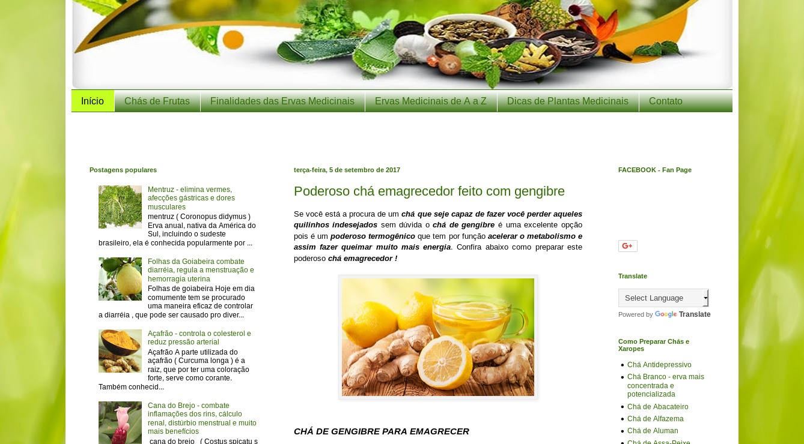
[http://www.ervasmedicinaiscuram.com/](http://www.ervasmedicinaiscuram.com/)

**Estética**

* _Diagramação_: Cabeçalho e menu ocupando toda a largura e 3 colunas de tamanhos diferentes

* _Cores_: Verde e preto, fundo branco

* _Fontes_: Sem serifa. Regular, negrito e negrito itálico.

* _Imagens_: Sempre fotos de perto, partes do corpo, plantas e preparos medicinais como chás, pós, pomadas etc.

**Interação**

* _Organização_: No menu superior há _links_ para a página inicial, páginas com conteúdo compilado pelo autor e contato, nesta ordem da esquerda para a direita. Abaixo, na coluna central está a informação selecionada pelo usuário, postagens ou páginas; a coluna da esquerda apresenta uma lista de postagens populares com foto, título e um trecho do texto; a coluna da direita apresenta listas com receitas, sintomas e plantas para acesso rápido.

* Navegabilidade: A hierarquia do _site_ é bastante simples, consistindo de postagens organizadas de diferentes formas dependendo da sessão visitada pelo usuário. Praticamente todo o conteúdo do blog pode ser acessado a partir da página inicial.

### Medicina Natural

[http://www.medicinanatural.com.br/](http://www.medicinanatural.com.br/)

**Estética**

* _Diagramação_: Menu no topo com duas colunas de tamanhos diferentes. No final da página, postagens e rodapé ocupando toda a largura

* _Cores_: Texto preto com _links_ em verde, cores diversas para títulos de seções.

* _Fontes_: Sem serifa. Regular e negrito. Páginas de postagem tem título com serifa bold.

* _Imagens_: Fotos de plantas e preparos fitoterápicos. Imagens com texto sobreposto.

**Interação**

* _Organização_: No menu há alguns submenus que levam para classificações específicas de algumas postagens. A coluna esquerda consiste principalmente _links_ para postagens com títulos e fotos, organizadas por categoria. Na coluna direita há um campo de busca, _links_ para uma loja de produtos naturais e uma lista de postagens recentes. As categorias são repetitivas genéricas.
Na página de postagem a coluna direita mostra um campo de busca, um menu com as 5 postagens mais populares ou recentes, campo para assinar conteúdo via e-mail e uma sessão "veja também".

* _Navegabilidade_: O _site_ possui a estrutura de blog: postagens organizadas por categorias. As categorias podem ser facilmente acessadas pelos menus disponíveis. O campo de busca facilita a busca por conteúdos específicos. As sugestões de postagens à direita levam o leitor a seguir no _site_ lendo conteúdos que não necessariamente estava buscando inicialmente.

### As Plantas Medicinais

[http://www.asplantasmedicinais.com/](http://www.asplantasmedicinais.com/)

**Estética**

* _Diagramação_: Duas colunas de tamanhos distintos, sem menu. No topo há uma barra com postagens em alta, mas que são as mesmas mostradas na área principal do _site_. O rodapé possui uma área com 6 postagens da categoria "Planta" e um botão para voltar ao topo.

* _Cores_: Textos em preto e cinza, detalhes em azul.

* _Fontes_: Sem serifa. Regular e Negrito.

* _Imagens_: Fotos sempre de perto. Plantas, retratos e outras partes do corpo, preparados de plantas medicinais.

**Interação**

* _Organização_: Na coluna principal são exibidos em lista matérias de plantas medicinais; na secundária, à direita, há um navegador de postagens populares, _link_ para contato e política de privacidade e _sites_ parceiros.

* _Navegabilidade_: A falta de uma área de busca ou de acesso às categorias do blog dificultam muito a navegação, o usuário fica limitado às postagens que estão dispostas na página inicial. Como nos outros portais do tipo blog, as sessões são repetitivas, sem uma distinção explícita entre as seções dispostas.

### Tua Saúde

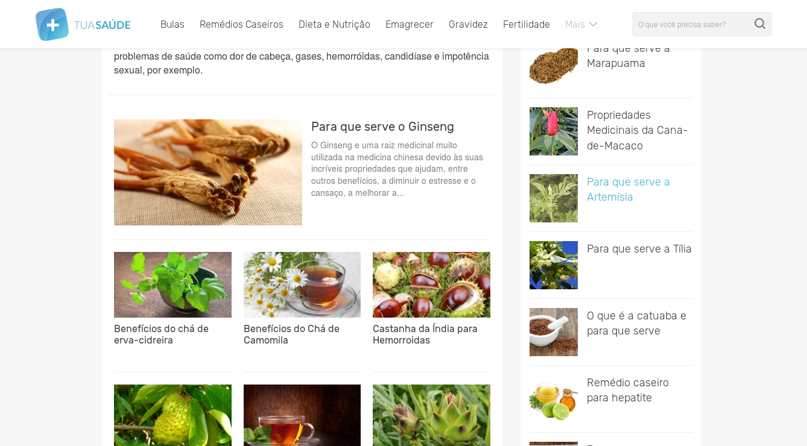
[https://www.tuasaude.com/c/plantas-medicinais/](https://www.tuasaude.com/c/plantas-medicinais/)

**Estética**

* _Diagramação_: Barra com menu no topo ocupando a largura toda. Corpo com duas colunas de tamanhos diferentes. O rodapé contém um campo de e-mail para assinatura do conteúdo e _links_ sobre a estrutura e regras.

* _Cores_: Fundo e fontes em tons de cinza, preto-e-branco suavizado. Detalhes em cinza frio escuro e azul-claro.

* _Fontes_: Títulos com sem-serifa _display_ e corpo sem serifa. Regular e negrito.

* _Imagens_: Fotos em _close_ de plantas e preparados medicinais.

**Interação**

* _Organização_: A barra superior conta com outras seções do _site_ TuaSaúde e um campo de busca, ela fica visível sempre que o usuário rola a página para cima. Na coluna principal há um parágrafo sobre plantas medicinais, uma lista de postagens blocos com imagem e outra sessão de postagens em blocos com título e um trecho do texto. Na coluna lateral estão as postagens populares da sessão Plantas Medicinais. As postagens estão em dois formatos com padrões mais ou menos definidos: "Propriedades medicinais/Para que serve" e “Benefícios”. A primeira categoria fala um pouco sobre a planta, posologia, contra-indicações e efeitos colaterais; a segunda fala sobre propriedades medicinais e os diversos preparos para diferentes finalidades. Ao acessar uma postagem são mostrados _blogs_ com mais textos sobre tema no final da coluna principal.

* _Navegabilidade_: A hierarquia do _site_ é bastante simples, sendo composta de postagens diversas dentro da categoria "Plantas Medicinais" e relacionadas entre si através de etiquetas. O campo de busca sempre presente facilita na hora de busca informação sobre uma planta específica. Ao acessar uma postagem, fica um _link_ no topo da página que leva de volta à seção de Plantas medicinais. Os _links_ relacionados ajudam a aprofundar a leitura ou a encontrar uma informação que não está na primeira página sobre o tema encontrada pelo usuário.

### Memorial Sloan Kettering Cancer Center

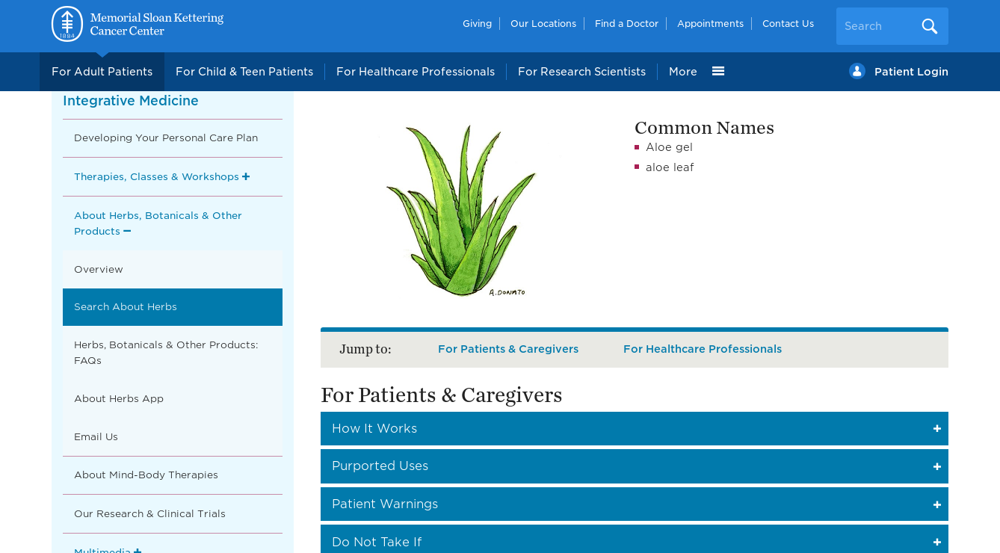
[https://www.mskcc.org/](https://www.mskcc.org/)

**Estética**

* _Diagramação_: Duas barras fixas no topo com campo de busca e menus para diferentes públicos alvos; adultos, crianças, profissionais da saúde e pesquisadores. O corpo do _site_ é composto Por uma coluna principal e uma secundária de tamanhos diferentes. No final há um rodapé com contato e mapa do _site_.

* _Cores_: Texto preto em fundo branco e branco em fundos coloridos. Detalhes em tons de azul e cinza frio.

* _Fontes_: Títulos com serifa regular. Corpo de texto e demais itens sem serifa regular e negrito.

* _Imagens_: Aquarelas ilustrativas, não-científicas

**Interação**

* _Organização_: Ao pesquisar por uma planta, os resultados já indicam alguns dos usos supostos e _links_ para mecanismos de ação [farmacológica] e potenciais interações [medicamentosas]. Na página da planta a parte superior mostra o caminho da página inicial até a seção atual. A coluna da esquerda indica outras seções irmãs e pais relacionadas com a atual. A coluna principal mostra uma ilustração da planta com nomes populares. Abaixo as informações são dispostas em blocos expansíveis divididos em duas categorias: Para pacientes e cuidadores, com informações breves sobre o funcionamento, usos supostos e contraindicações; e para profissionais da saúde com estas informações mais aprofundadas e referências para trabalhos científicos além de outras informações como interações medicamentosas, mecanismo de ação e sumário clínico. Em seguida há um campo de busca e um alfabeto para busca por palavra ou letra inicial. No final de cada bloco há um _link_ para retornar ao topo.

* _Navegabilidade_: O acesso da página inicial até a seção de plantas medicinais não é óbvio para o usuário, a hierarquia do _site_ possui muitos níveis verticais e as plantas medicinais estão no sexto nível. Ainda sim a busca no topo é bem visível e encontra com facilidade uma planta específica por nome popular ou científico; também é possível acessar diretamente a seção de plantas diretamente a partir da busca. Mesmo com bastantes elementos gráficos e a navegação é facilitada com títulos grande nas seções importantes e os _links_ de retorno ao topo colocados em pontos estratégicos. Da página de uma planta também é possível acessar outras páginas como perguntas frequentes, aplicativos e visão geral das plantas.

### National Center for Complementary and Integrative Health

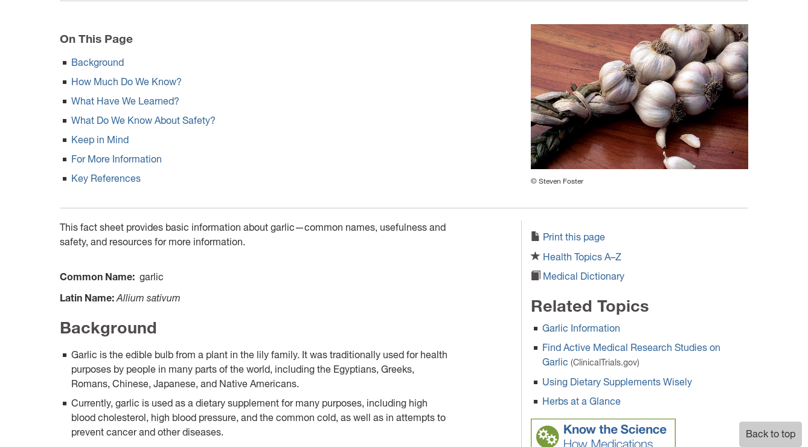
[https://nccih.nih.gov/](https://nccih.nih.gov/)

**Estética**

* _Diagramação_: Cabeçalho com campo de busca, _link_ para _site_ em espanhol e seções principais do _site_. O corpo possui duas colunas de larguras diferentes. O rodapé possui _links_ para redes sociais, mapa do _site_, detalhes burocráticos. Um _link_ para retornar ao topo fica visível a partir do momento em que o usuário começa a rolar a página para baixo.

* _Cores_: Texto em cinza escuro sobre fundo branco, detalhes em azul.

* _Fontes_: Sem serifa, regular e negrito.

* _Imagens_: Fotos das plantas.

**Interação**

* _Organização_: A página principal mostra uma descrição da seção e uma lista de plantas na coluna principal; a coluna secundária possui um campo de e-mail para assinar o conteúdo do _site_. A página da planta contém uma lista de _links_ com os campos de informação, os campos estão organizados com perguntas e declarações: _Background_, O quanto sabemos?, O que aprendemos?. O que sabemos sobre segurança?. Guarde isto, Para mais informações e Referências-chave. Após esta lista vêm os campos propriamente ditos com os respectivos conteúdos textuais. Na coluna secundária há uma foto da planta, _links_ para impressão, tópicos de A-Z, dicionário médico e tópicos relacionados.

* _Navegabilidade_: O menu do cabeçalho garante facilmente acesso a todas as áreas do _site_ com apenas um clique, a informação hierarquizada visualmente facilita bastante o processo de encontrar a informação desejada. O campo de busca bem visível com margens grandes também aumenta a navegabilidade do _site_. Na página das plantas o menu com _link_ para os campos agiliza o acesso à informação desejada.

### Análise geral

<table>
  <tr>
    <td><em>Site</em></td>
    <td>Pontos positivos</td>
    <td>Pontos negativos</td>
  </tr>
  <tr>
    <td>Ervas Medicinais curam</td>
    <td></td>
    <td>Desorganização, falta de referências, não tem campo de busca</td>
  </tr>
  <tr>
    <td>Medicina Natural</td>
    <td>Campo de busca e layout arejado</td>
    <td>Categorias repetitivas, falta de referências</td>
  </tr>
  <tr>
    <td>As Plantas Medicinais</td>
    <td>Layout arejado</td>
    <td>Não há campo de busca, falta de referências</td>
  </tr>
  <tr>
    <td>Tua Saúde</td>
    <td>Layout arejado, boa navegabilidade, formatos padrão de postagem, contraindicações</td>
    <td>Não há referências</td>
  </tr>
  <tr>
    <td>MSKCC</td>
    <td>Conteúdo bem diagramado, layout arejado mesmo com muitos elementos, boa organização da informação.</td>
    <td>Dificuldade de encontrar a seção de plantas medicinais num primeiro momento, pode ser ‘hostil’ao usuário desavisado.</td>
  </tr>
  <tr>
    <td>NCCIH</td>
    <td>Layout simples com elementos suficientes, navegação com poucos cliques.</td>
    <td>Falta de informações sobre posologia e uso das plantas, foco exclusivo em pesquisadores e profisisonais.</td>
  </tr>
</table>

A análise de similares permitiu visualizar possíveis soluções para algumas das necessidades levantadas nas seções XX _Briefing_, XX _Personas_ e XX Jornadas de usuário. Para garantir o acesso e a leitura correta das informações dispostas na tela, é imprescindível um _layout_ arejado, organizado e com destaque para as seções principais. A utilização de uma arquitetura com poucos níveis de hierarquia, a exemplo do NCCIH, permite que com apenas um clique seja possível acessar qualquer área do _site_ através de um menu interativo. Em relação às paletas de cores, foi possível observar que todos usaram tons de cinza com destaques em cores saturadas, nesses destaques predominaram o azul e o verde; verde para _sites_ mais informais, conectando com plantas, natureza e até algo de místico ou mágico; azul para os _sites_ institucionais e com mais referências das informações apresentadas, trazendo através da cor essa institucionalidade para dar confiança ao usuário.

## Análise de tendências

Além da análise de _sites_ que tratam do mesmo tema do projeto aqui desenvolvido, é importante a análise dos _sites_ em si enquanto uma mídia para que seja possível ampliar o horizonte de soluções e também para entender qual é o ambiente gráfico que o usuário está habituado e lidar. Nesta análise foi feito o levantamento de características que se destacavam em cada uma das páginas e de recursos que se repetiam entre as páginas selecionadas.

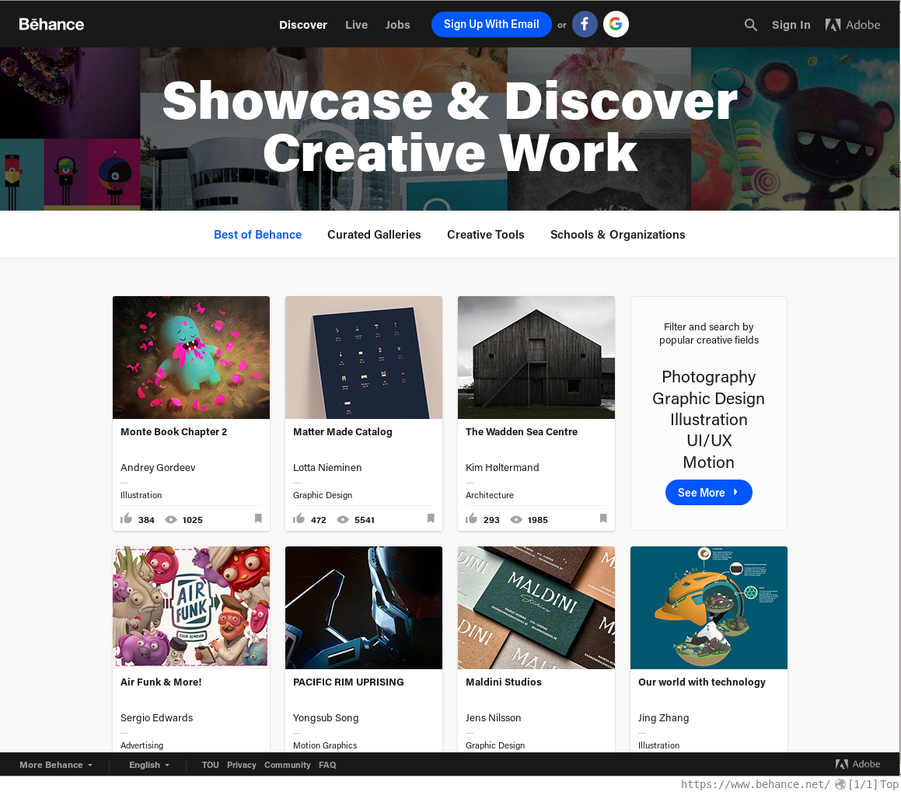

* Menu pequeno no topo
* Frase destacada
* Conteúdo centralizado
* Grade com _cards_ valorizando as imagens

### Dribbble

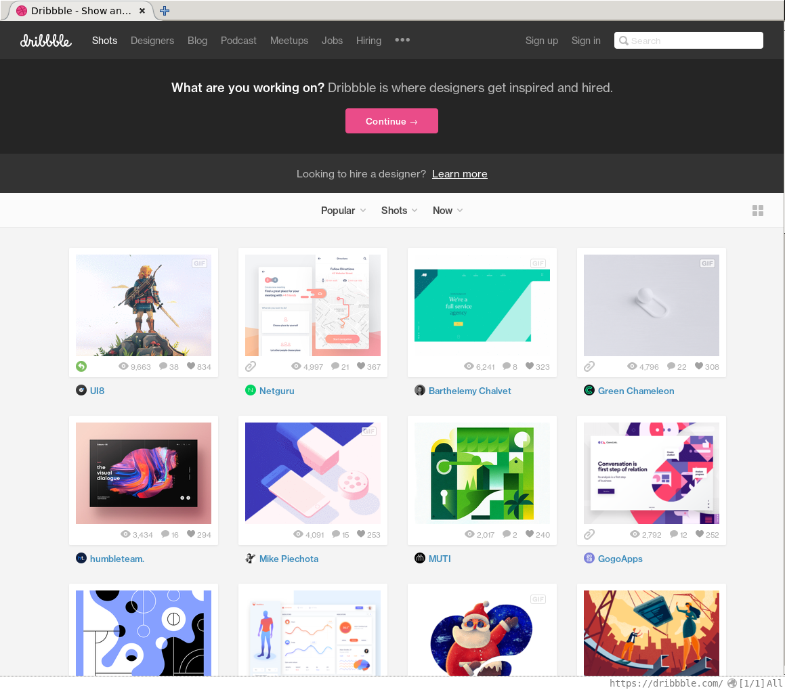

* Menu pequeno no topo
* Frase destacada com elemento interativo
* Conteúdo centralizado
* Elementos interativos para públicos diferentes no cabeçalho
* Grade com _cards_ valorizando as imagens

### Youtube - busca

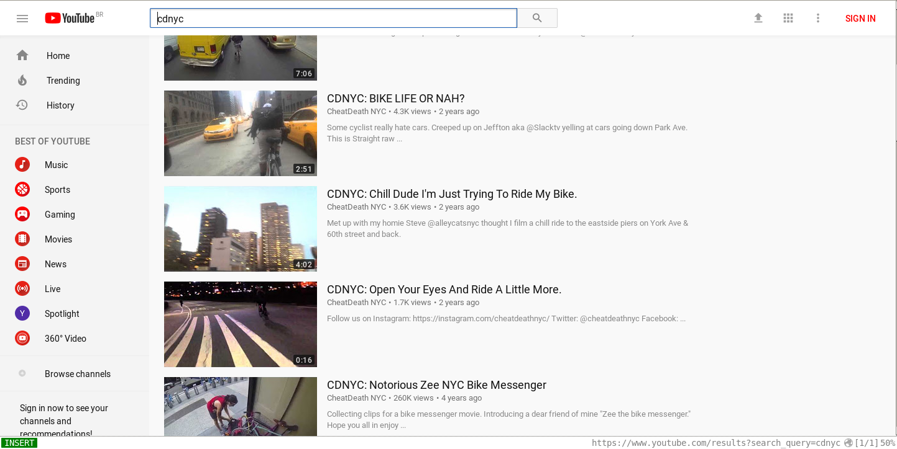

* Menu simples no topo
* Menu lateral com ações do usuário
* _Cards_ horizontais equilibrando imagem e informação textual
* Destaque para as imagens na busca
* Conteúdo descentralizado

### Gmail

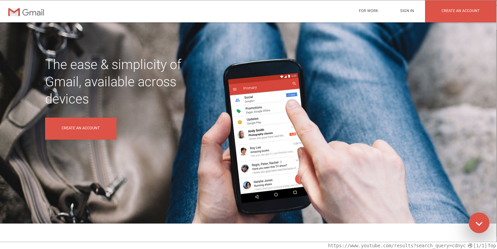

* Composição com imagem de fundo
* Espaço, poucos elementos interativos
* Elemento interativo para navegação vertical
* Menu no topo
* Frase destacada com elemento interativo
* _Layout_ descentralizado
* Destaque com cores

### MDN 

* Imagem de fundo
* Campo de busca centralizado e destacado
* Frase destacada
* Menu no topo
* Conteúdo centralizado
* Elemento interativos para públicos diferentes

### Travis Neilson

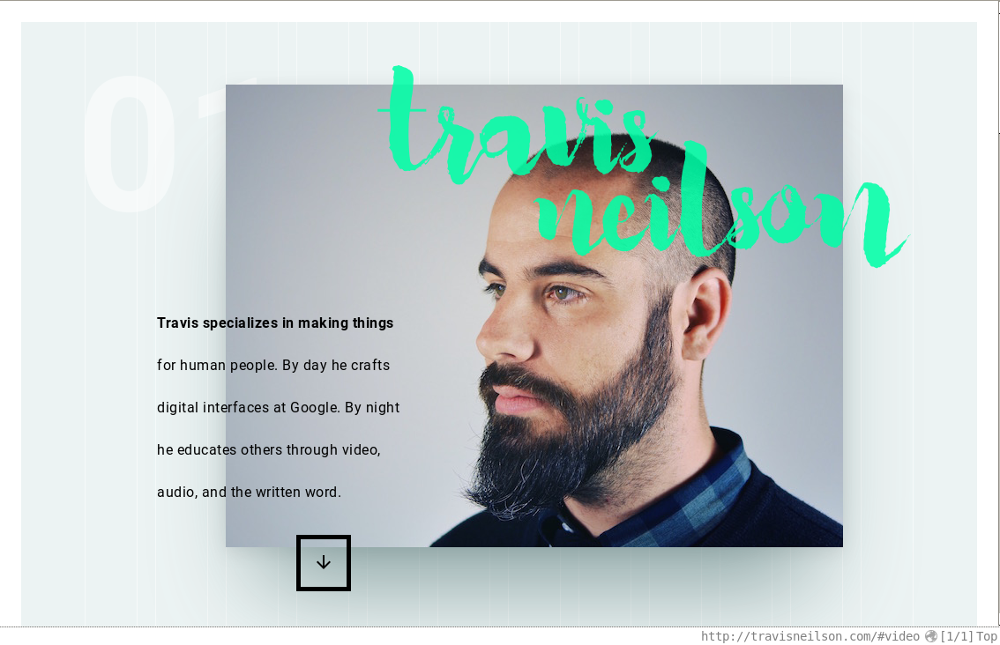
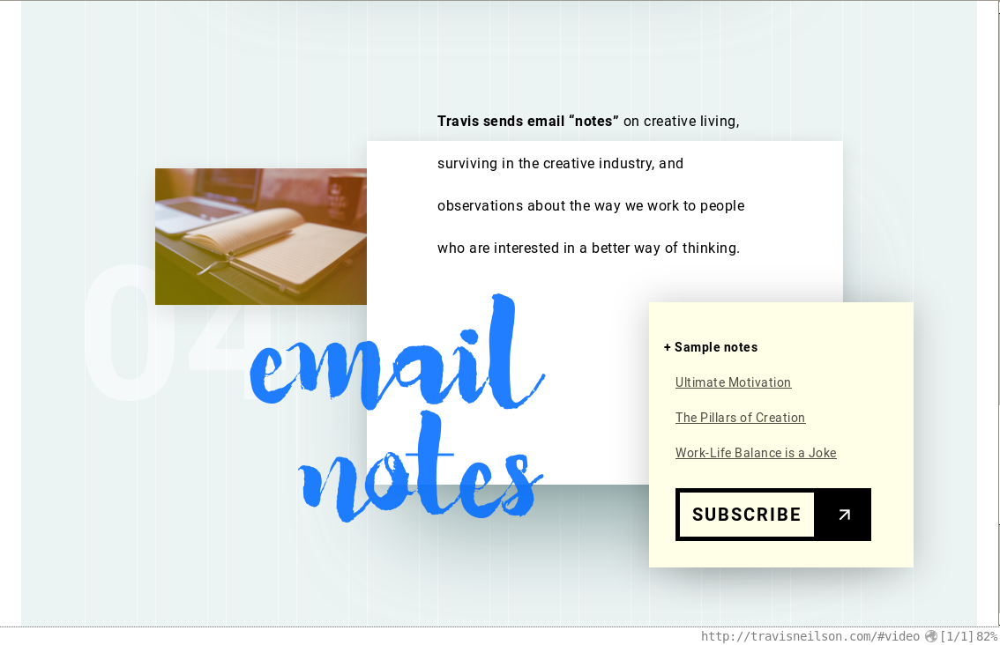

* Poucos elementos e bastante espaço
* Tridimensionalidade
* Elemento interativo para navegação vertical
* Grade modular com elementos sobrepostos
* _Cards_ para separar elementos interativos e conteúdos
* Destaque com cores
* Conteúdo descentralizado

### Bourbon

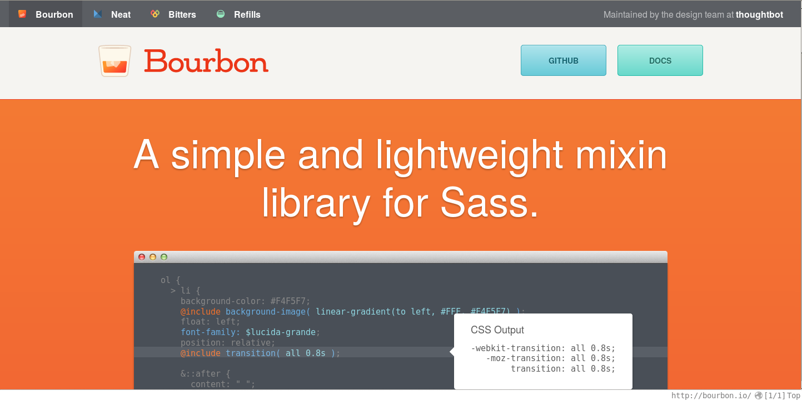

* Menu pequeno no topo
* Poucos elementos, bastante espaço
* Frase destacada
* Conteúdo centralizado

### DuckDuckGo

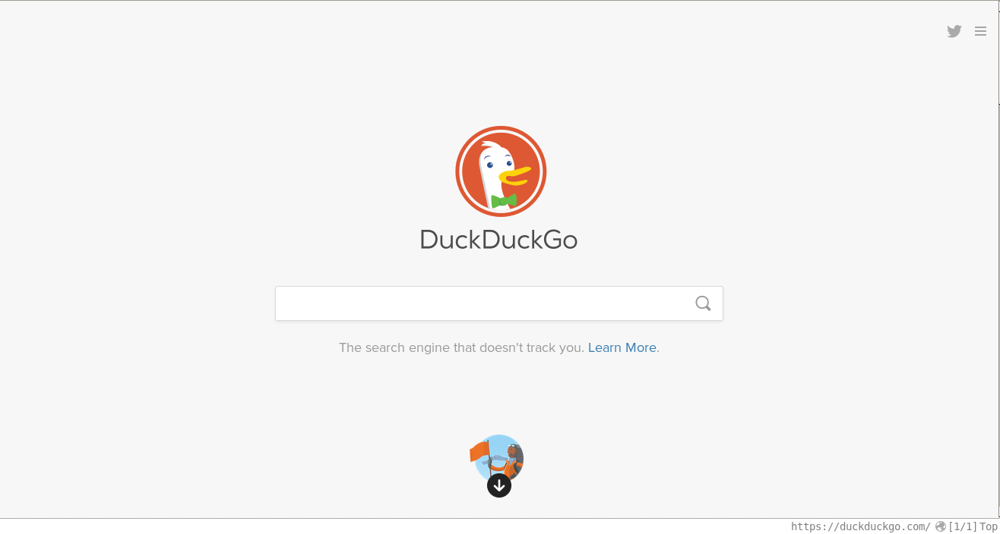

* Poucos elementos, bastante espaço
* Elemento interativo centralizado
* Conteúdo centralizado
* Elemento interativo para navegação vertical
* Menu interativo no canto superior

### DevTips

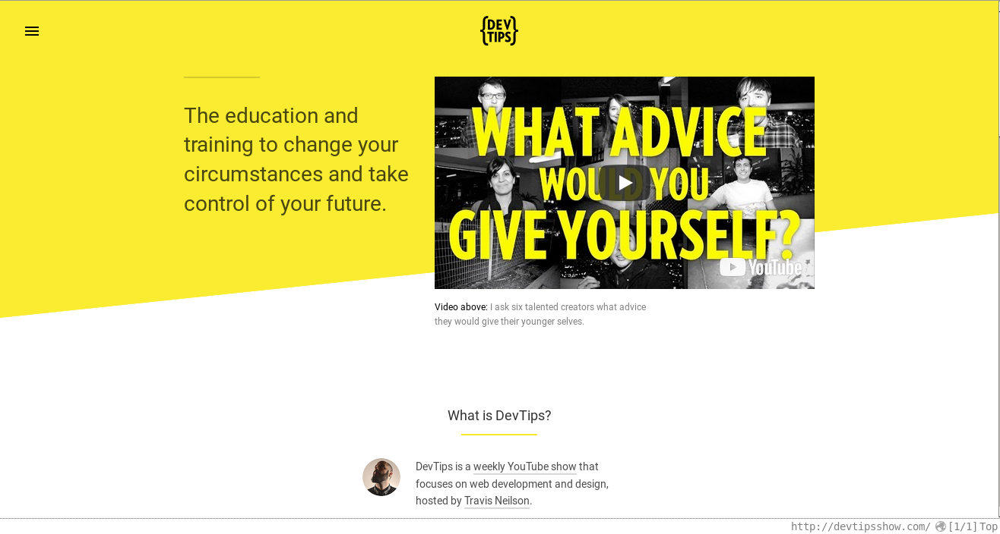

* _Layout_ centralizado
* Poucos elementos, bastante espaço
* Menu no canto superior
* _Layout_ descentralizado
* Cor destaque

### Análise geral

* _Estética_ 
	* Valorizar imagens, principalmente na busca.
	* Margens e espaços vazios ajudam a encontrar a informação de forma direta
	* Paleta com cinzas a uma cor-destaque
	* Uma frase simples e direta que explique o que é o _site_.
	* Página em 'blocos' com Elemento interativo para navegação vertical
* _Navegabilidade_ 
	* _Cards_ horizontais ajudam a mostrar mais informações textuais e não sobrecarregar a páginas
	* Manter um menu simples no topo que permita acessar diversas áreas do _site_ a partir de qualquer página
	* Poucos elementos e destaque para Elemento interativos

Esta etapa foi muito importante para confirmas algumas das ideias e soluções encontradas na seção XX Análise de similares. _Layouts_ com margens grandes e poucos elementos foram encontrados na maioria das páginas visitadas, mostrando que além de uma necessidade do público-alvo deste projeto, são soluções gráficas com as quais usuários da _internet_ estão familiarizados. O mesmo é possível aformar sobre a paleta de cores com predominância de tons de cinza e cores saturadas para destacar elementos interativos.

Elementos que surgiram nesta etapa mas que também são recorrentes entre as soluções analisadas são a presença de menus discretos de cor escura no topo da tela e de frases curtas destacadas que descrevem em poucas palavras a intenção do _site_. O menu é uma solução muito eficiente para a questão da navegação no _site_ do Horto Medicinal pois permite acessar diversas áreas sem poluir a página ou tirar a atenção de outros elementos. 

# Plano de escopo

Garret XX afirma que o escopo surge a aprtir da tradução das necessidades de usuários e objetivos do produto em conteúdo e elementos funcionais do mesmo. No plano de escopo serão descritos o conteúdo que será veiculado, os requisitos organizacionais e funcionais do _site_ do Horto Medicinal e as delimitações do projeto.

## Conteúdo

Por tratar-se de um produto já existente, o _site_ do Horto Medicinal já possui um conteúdo próprio bastante completo. No entanto este conteúdo encontra-se bastante desorganizado, dificultando o acesso à informação. Em relação ao conteúdo, este projeto se limitará à reorganização do conteúdo já existente e não irá focar na criação de conteúdos novos.

## Requisitos de projeto

Os requisitos de projeto são de importância fundamental para organizar o seu desenvolvimento posterior. Eles funcionam como um guia para as etapas subsequentes da metodologia.
Neste trabalho os requisitos serão divididos em duas categorias. A categoria de **organização do conteúdo** irá tratar das soluções estéticas e organizacionais que atendam às necessidades levantadas na etapa XX Plano de estratégia. Os **elementos funcionais** buscarão sanar tais necessidades levando em conta a interação do usuário e os elementos que a facilitam.

### Organização do conteúdo

A organização do conteúdo será feita seguindo o caminho do usuário da página inicial à página e às informações pelas quais está buscando.

A página inicial do _site_ precisa ser entendida com facilidade para o usuário e destacar a busca pro plantas, pois essa é a principal função do site; esta necessidade pode ser suprida por um _layout_ arejado com poucos elementos e um elemento interativo central. Também é preciso garantir acesso às funções administrativas e às sessões sobre o horto sem que estas ofusquem o elemento principal da página. Estas informações podem ficar organizadas em um menu na parte superior da tela, conforme algumas soluções apontadas na seção XX Análise de referências.

O resultado da busca por plantas precisa evidenciar a imagem o os nomes das plantas, pois são as informações que irão guiar a escolha do usuário. A organização dos resultados na forma de _cards_ contempla estas necessidades além de otimizar o espaço da tela e organizar os resultados em blocos visuais.

Na página de informações da planta, os nomes e a imagem devem continuar destacados para fazer uma ligação estética entre a busca e a página acessada; visualizar a imagem em tamanho maior também tem a função de confirmar a espécie da planta pesquisada. Em razão dos dois públicos-alvo distintos, as informações devem ser organizadas em duas áreas específicas, semelhante à organização do site MSKCC analisado na seção XX Análise de similares; como o Grupo Pessoal possui um grupo maior de usuários e precisa acessar a informação rapidamente, a área destinada a este grupo deve ter maior destaque e vir em primeiro lugar na página.

1. _Página inicial_
	1. _Layout_ com poucos elementos
	2. Destaque para a função de busca
	3. Menu superior que chame pouca atenção com funções secundárias

2. _Resultados da busca_ 
	1. Organização em _cards_ com imagem e texto

3. _Página da planta_
	1. Destaque para a imagem e os nomes científico e populares
	2. Divisão entre conteúdo voltado para o Grupo Pessoal e o Grupo Profissional
	3. O conteúdo par ao Grupo pessoal é prioritário e deve aparecer primeiro na página
	4. O item de sugestões deve estar presente junto da área do Grupo profissional

### Requisitos estéticos

Nos requisitos estéticos serão descritas as fontes utilizadas, a diagramação , a paleta de cores e o tipo de imagens utilizados nas etapas subsequentes a esta.

Em relação às fontes, será utilizada uma família sem serifa por adequar-se melhor à leitura em telas e por ser a fonte de texto de todas as alternativas pesquisadas durante o capítulo XX Plano de estratégia. Não serão utilizadas famílias diferentes para títulos e elementos textuais destacados em função do ruído que podem gerar, estes elementos serão compostos com uma variação em negrito da fonte de texto. O grande volume de nomes científicos e técnicos em outros idiomas também requer que haja uma variação em itálico da fonte de texto.

A diagramação deverá ser flexível para exibir telas com conteúdos centralizados e com conteúdos divididos verticalmente, facilitando a disposição de dos diversos elementos que compõe as páginas. Para possibilitar uma variedade maior de _layouts_, o _grid_ deve ter um número de colunas múltiplo de 2 e 3.

Para a paleta de cores, será utilizada uma escala de cinzas, evitando o branco e o preto puros pois o grande contraste cansaria facilmente o usuário que esteja fazendo uma leitura mais loga no site. Elementos destacados serão contemplados com uma cor saturada.

Para o tipo de imagem utilizado no site, a fotografia é a que melhor cumpre a função de identificação das plantas. Esta decisão também se apoia nas alternativas descritas na seção XX Análise de similares em que a maioria dos sites apresentou a fotografia como recurso imagético.

1. _Fontes_
	1. Corpo de texto: sem serifa regular
	2. Nomes científicos: itálico regular
	3. Títulos: negrito

2. _Diagramação_ 
	1. Grade modular com número colunas múltiplo de 2 e 3

3. _Cores_ 
	1. Escalas de cinza com cores saturadas para destaque

4. _Imagens_ 
	1. Fotos em _close_ das plantas

### Elementos funcionais

Os elementos funcionais comportam os recursos através dos quais o usuário interage com a página, enviando e recebendo informações. Para o _site_ do Horto Medicinal, estes elementos foram separados entre os de navegação, em que há interação com o conteúdo disposto, e os de administração, através dos quais é feita a alteração, adição e remoção dos conteúdos.

Para a navegação é essencial poder transitar entre as diferentes áreas do site com facilidade, para isso será necessário um menu no topo da tela que esteja fora da tela quando não é necessário e que apareça assim que o usuário começar a procurá-lo, movendo o mouse para o topo da tela ou rolando a página para cima. Para ampliar o alcance deste menu sem que ele fique poluído ou sobrecarregado com elementos, páginas e conteúdos abaixo da hierarquia principal devem estar aninhados no menu e mostrados usando _popups_; para que este recurso não seja difícil de utilizar, é necessário que não haja muitos níveis hierárquicos de organização. A busca do _site_ deve ser versátil e funcional, pois é o principal recurso de acesso às informações sobre as plantas, além da busca textual é necessário poder buscar por categorias como classificação botânica, sintomas sobre os quais age, lista de nomes populares, científicos etc.; é necessário que o gerenciador de conteúdo suporte a utilização de categorias e etiquetas que possibilitem esse tipo de busca.

As funções administrativas requerem uma interface à parte, acessível através de um mecanismo de login. Esta interface não será operada por especialistas da área, então ela precisa ser intuitiva e de aprendizado fácil. Para que encontrar com facilidade o conteúdo a ser editado nesta interface, ele deve ser exibido da forma mais semelhante possível à forma que aparece no _site_. A adição de novas plantas será muito facilitada pela possibilidade de criar e utilizar padrões de postagem com campos pré-definidos.

1. _Navegação_
	1. Menu aparente sempre que o usuário rolar a página para cima
	2. _Popups_ no menu que permitam acessar todas as áreas do site
	3. Sumários com _links_ na tela inicial das páginas de plantas.
	4. Poucos níveis de hierarquia entre as páginas para facilitar a navegação
	5. Sistema de classificação por categorias e etiquetas.

2. _Administração_
	1. Tecnologia fácil de aprender a usar
	2. Similaridade entre a aparência do conteúdo em edição e do disposto na página
	3. Padrões para a postagem de novas plantas

## Delimitações

As delimitações de projeto têm a função de indicar até onde é possível chegar e quais são os seus limites. Nesta seção serão descritas as delimitações da criação do _site_ do horto medicinal.

A necessidade de uma plataforma para gerenciar o conteúdo irá limitar as possibilidades de layout. A partir da escolha do gerenciador que estas limitações ficarão mais definidas.

O uso de _software_ livre pode limitar ou atrasar o desenvolvimento de algumas etapas do projeto. Quando for o caso, será feita opção por um _software_ de código aberto não-livre e, em último caso, por _software_ proprietário de código fechado.

Não será feita proposta construtiva para dispositivos móveis, apenas versão para _desktop_. A implementação em dispositivos móveis segue guias e regras distintas das analisadas neste trabalho, mas pode ser desenvolvido em um outro momento aproveitando muito do que está relatado aqui.
