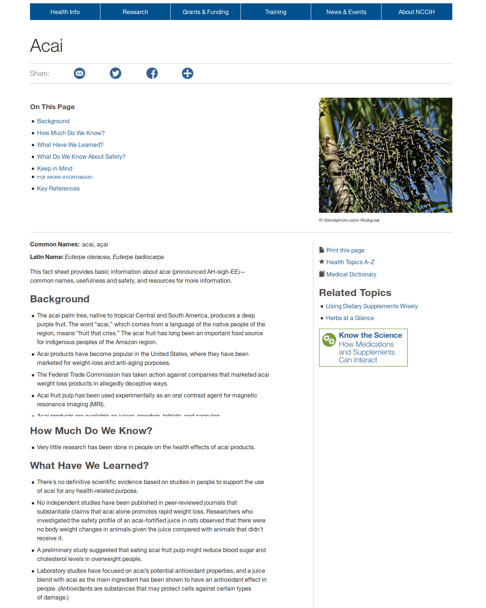
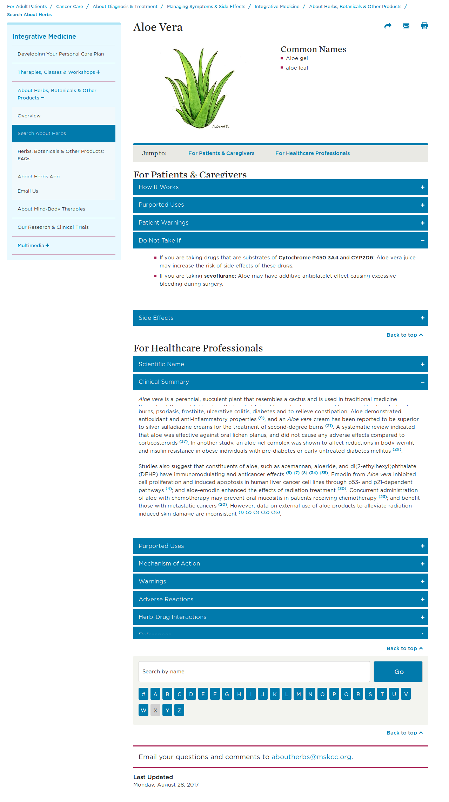

# Introdução

## Apresentação do tema

O uso de plantas como tratamento medicinal é uma prática comum e muito antiga no Brasil, onde uma grande parte da população as utilizam ou como opção única de tratamento ou em associação com medicamentos sintéticos.  Mesmo assim pouco ou nada se fala a respeito disso nos meios acadêmicos e/ou profissionais da área da saúde. O Horto Didático de Plantas Medicinais da UFSC (neste trabalho referido como Horto Medicinal) foi criado junto ao Hospital Universitário, em 1999, com a proposta de ser um espaço aberto à comunidade interessada no estudo, formação e informação sobre o uso das plantas pela população e também de servir como laboratório e espaço didático para o ensino e a pesquisa sobre plantas medicinais dentro da UFSC. O Horto Medicinal está pautado em diversas políticas e programas que regulamentam e incentivam o uso de plantas medicinais e fitoterápicos como opção de tratamento tais como: o Programa Nacional de Plantas Medicinais e Fitoterápicos[1]; a Política Nacional de Práticas Integrativas e Complementares no SUS[2]; a Comissão de Práticas Integrativas e Complementares da secretaria municipal de saúde de Florianópolis[3]. Como forma de divulgar o conhecimento produzido, o Horto Medicinal possui um *website* ([https://hortomedicinaldohu.ufsc.br/](https://hortomedicinaldohu.ufsc.br/)) com informações sobre o Horto e sobre plantas medicinais.

*Site atual do Horto Medicinal*

*Arquivo do autor*

No website é possível acessar uma base de dados com informações sobre uso popular, ações farmacológicas, contra indicações, interações medicamentosas, reações adversas, fotos e nomes populares diversos de cada planta. Atualmente esta base de dados conta com 220 plantas. No entanto, a formatação do website não é adequada à leitura, tornando-se uma barreira no acesso à informação. Esta inadequação é decorrente, principalmente, da falta de manutenção da estrutura da página que, desde a sua criação, não foi atualizada em relação a novas tecnologias de desenvolvimento web que surgiram neste período.

A *web* é uma mídia extremamente dinâmica. Primeiro porque está em um processo constante e intenso de transformação devido à grande participação dos usuários na sua construção; segundo porque há uma grande diversidade de suportes para a sua visualização: computadores, Tvs, celulares, *tablets *etc. Assim, conteúdos que estão dispostos na rede precisam ser constantemente reformados para que se adequem  às novas técnicas, suportes e públicos que surgem o tempo todo. Estudar mídias e organizar informações nela é uma prática de design gráfico.

Portanto, o design gráfico pode ser aplicado no contexto do Horto Medicinal na organização da informação disponibilizada pelo Horto. Esta organização pode tomar a forma de uma cartilha ou guia impresso, uma campanha de cartazes de propaganda, um portfólio impresso ou digital, entre outras. Dentre estas possibilidades, a alternativa vista como mais viável é a construção de um novo *website*. A escolha se justifica principalmente pela necessidade de constante atualização do conteúdo, revisões bibliográficas e novas pesquisas ocorrem constantemente e estas informações precisam ser atualizadas. O meio digital oferece esta possibilidade de atualização com mais agilidade e menos trabalho em relação às outras alternativas. Também é possível citar a relação custo/benefício desta escolha; por tratar-se de mídia digital, não há custos com a produção ou impressão do material. Por fim, há o alcance do material para além das barreiras físicas, podendo ser acessado em qualquer lugar e ponto do mundo com acesso à internet.

Tendo em vista o Horto Medicinal como um serviço de interesse público, acadêmico e popular, apoiado por iniciativas nacionais e municipais; a existência de uma base de dados extensa em constante atualização; e a organização dessa informação em meio digital como alternativa mais adequada e viável, o projeto busca responder a seguinte pergunta: como organizar e apresentar, de forma adequada e acessível ao público, as informações contidas no *website* do Horto Medicinal?

## Objetivos

### Objetivo geral

Desenvolver a estrutura, *layout*, e *styleguide* de um *website* para organizar as informações do Horto Medicinal.

### Objetivos específicos

* Mapear o conteúdo que será veiculado no site.

* Identificar o público-alvo.

* Descrever alternativas similares de sites.

* Pesquisar alternativas em software livre.

* Adequar a tipografia e demais elementos gráficos à identidade visual do Horto medicinal e ao público alvo.

* Documentar as soluções gráficas e estruturais em um *styleguide*.

## Justificativa

Desde o início da do período de graduação, o autor esteve interessado pela atuação que o designer pode ter junto a ações de preservação, proteção e educação ambiental. Por isso trabalhou com grupos da UFSC e de fora que realizam estudos sobre temas como a permacultura, a agroecologia e plantas alimentícias e medicinais da agrobiodiversidade.

Dentro da UFSC, o autor cursou a disciplina optativa Introdução à Permacultura (GCN7938). HOLMGREN(2013, p. 33) define a permacultura como o uso do pensamento sistêmico e de princípios de design para o planejamento de paisagens produtivas a partir de padrões e relações encontradas na natureza, ou seja, uma ciência que une design, produção de recursos renováveis e preservação ambiental. Após a disciplina, o autor passou a atuar como voluntário no Núcleo de Estudos em Permacultura (NEPerma) para cumprir a disciplina de estágio obrigatório. O trabalho foi  vinculado ao projeto de Recuperação Ambiental do Bosque do CFH em que desenvolveu-se uma cartilha digital sobre o projeto e placas informativas para o espaço do bosque.

*Placas no bosque da UFSC projetadas durante estágio obrigatório. *

*Fonte: arquivo do autor*

*Spreads de material informativo desenvolvido durante estágio obrigatório.*

*Fonte: arquivo do autor*

No ano seguinte (2017) o autor participou na escrita de um projeto de extensão, no qual atuou como bolsista, para auxiliar com a comunicação de projetos de extensão ambiental. Os projetos escolhidos foram o Núcleo de Educação Ambiental da UFSC (NEAmb) e o Horto Medicinal, para os quais foram criadas identidades visuais. A construção do novo site do Horto Medicinal será uma das aplicações desta identidade é uma forma de ampliar a sua comunicação.

*Logotipo da identidade visual desenvolvida durante o projeto de extensão.*

*Fonte: arquivo do autor*

Além de ser uma forma de concretizar os estudos e práticas realizadas pelo autor durante a graduação, o projeto é de interesse para futuras pesquisas e práticas pois visa integrar e atender as necessidades de públicos com necessidades distintas: profissionais da área da saúde,  pessoas leigas no assunto buscando auto-tratamento ou informações adicionais sobre um tratamento prescrito e também pesquisadores de diversas áreas com interesse em plantas medicinais.

Também vale ressaltar que para este projeto serão avaliados e utilizados sempre que possível *softwares* livres em detrimento dos proprietários. De acordo com a* Free Software Foundation*[4], para ser livre o software precisa atender a quatro liberdades:

* *A liberdade de executar o programa como você desejar, para qualquer propósito (liberdade 0).*

* *A liberdade de estudar como o programa funciona, e adaptá-lo às suas necessidades (liberdade 1). Para tanto, acesso ao código-fonte é um pré-requisito.*

* *A liberdade de redistribuir cópias de modo que você possa ajudar a**o próximo (liberdade 2).*

* *A liberdade de distribuir cópias de suas versões modificadas a outros (liberdade 3). *

A mesma fundação também afirma que "*Usar *software* livre é tomar uma decisão política e ética que garante o direito de aprender e compartilhar com outras pessoas o que é aprendido. *Software* livre tornou-se a fundação de uma sociedade de aprendizado em que o conhecimento é compartilhado de forma que outros possam criar a partir deste conhecimento e aproveitar-se dos benefícios*." [5]

A partir desta perspectiva, pode-se entender o software livre como ideal para a atividade de pesquisa, pois facilita àqueles que queiram reproduzir a metodologia deste projeto o acesso a esses softwares, porque indivíduos e grupos interessados em desenvolvimento e/ou adaptação dos *softwares* podem encontrar na pesquisa uma documentação precisa e detalhada do seu uso em projetos de design e porque os resultados da avaliação dos softwares quanto a sua adequação a atividade projetual poderão ser enviados diretamente aos desenvolvedores para implementar as alterações cabíveis em futuras versões dos programas.

Outra contribuição deste trabalho à pesquisa acadêmica é a descrição das soluções encontradas na adequação ao meio digital de uma base de dados imagética e textual sobre plantas medicinais, que poderá servir como fundamento para trabalhos semelhantes. A organização de um site sobre plantas medicinais também se apoia em uma perspectiva social. Ele facilita o acesso à informação sobre plantas medicinais através da internet, um meio de grande alcance em relação às mídias físicas, a profissionais que atendam pessoas fazendo uso de plantas ou que desejem receitar plantas como forma de tratamento; também para que pessoas sem acesso a medicamentos industrializados possam fazer uso seguro e informado de plantas medicinais.

A ampliação do acesso à informação sobre plantas medicinais pode ser explicada como uma extensão do alcance de serviços públicos e gratuitos. O Horto Medicinal enquanto espaço aberto à sociedade ganhará visibilidade dentro e fora da UFSC. Também irá estender a abrangência  de programas nacionais e municipais de práticas integrativas e uso de plantas nos órgãos públicos de saúde.

## Metodologia

Tratando-se este de um projeto que busca uma solução em meio digital, será utilizada a metodologia proposta por Jesse James Garrett em seu livro *"The Elements of User Experience" *(2002)[6].

Garret (2002) ressalta, para além das questões funcionais e estética, a importância da experiência de usuário no desenvolvimento do projeto. Ao projetar para o meio digital, esta importância ganha mais peso por tratar-se de um meio de alta complexidade e que não tem um manual de instruções. O uso acontece baseado apenas em experiências anteriores do usuário.

Um *website* com projeto centrado no usuário é fundamental para garantir que as informações e funcionalidades sejam apresentadas de de forma que os usuários possam compreendê-las com facilidade.

Em Garret (2002) o autor propõe uma metodologia que divide o projeto em cinco etapas ou planos centrados na experiência de usuário. Estes planos se sobrepõem de forma que o mais abstrato fique em baixo e o mais concreto em cima, conforme demonstrado na figura 7.

*strutura metodológica proposta por Garrett. *

*Adaptado de Garret(2002)*

Com esta organização sequencial, o autor reforça a dependência de planos superiores aos inferiores. Por exemplo: o plano de esqueleto não pode ser dado por terminado enquanto os planos de estratégia, escopo e estrutura não estiverem definidos e finalizados. Também é importante ressaltar, conforme descrito na página 24, que a atividade em cada plano não é exclusiva e que decisões em uma etapa podem afetar tanto as etapas de coma quanto as de baixo, o importante é que elas sejam *finalizadas* de baixo para cima.

No projeto do site do Horto medicinal aqui proposto, o **plano de estratégia**, composto pelas necessidades do usuário e objetivos do produto, consistirá da criação de um *briefing* a partir da introdução do projeto, a construção de personas e suas respectivas jornadas de usuário a partir de entrevistas com o público-alvo e da análise de soluções estéticas e funcionais já existentes em site similares.

Para o **plano de escopo**, será feito o levantamento e organização de todo o conteúdo a ser veiculado no site e será realizada a listagem das funcionalidades, páginas e seções necessárias à veiculação do conteúdo.

No **plano da estrutura**, será criado o mapa do site a partir da relação de navegação das páginas e funcionalidades, quais as possibilidades de transitar no site de uma página a outra criando um mapa do site. Também será descrita a interação usuário-produto, como o site responde às ações realizadas pelo usuário.

O **esqueleto** será composto por protótipos de baixa fidelidade que possam ser utilizados em testes com usuários para saber qual a melhor disposição e organização dos elementos funcionais na tela.

A camada de **superfície** levará em conta os aspectos estéticos dos elementos dispostos no esqueleto. Nesta etapa serão feito todos os ajustes e acabamentos necessários a partir da identidade visual do Horto Medicinal e da análise de soluções similares.

# Plano de estratégia

No plano de estratégia serão registrados os objetivos do usuário e as necessidades dos usuários, levantando qual a forma de projetar o site e para quem ele será projetado. Isso se dará através de cinco etapas:

* **Briefing**: É o documento inicial do projeto, construído a partir de pesquisas com os gestores do site e pesquisas preliminares sobre o material existente.

* **Personas**: Sintetização dos perfis de usuários para facilitação do seu entendimento pelo projetista.

* **User Journeys**: Descrição das possibilidades de interação das personas com o site. Indica quais ações serão realizadas e quais necessidades essas ações demandam.

* **Análise de similares**: Um levantamento de sites com funções semelhantes às do site projetado para analisar soluções já existentes.

* **Análise de referências**: Criação de um painel com sites de diversas áreas para estudo de tendências de caráter estético e organizacional.

## Briefing

O *briefing* é uma ferramenta que descreve as condições e necessidades iniciais de um projeto. Segundo Pazmino (2015, p. 22) não existe um formato ou modelo ideal pré-determinado para o *briefing*, ele deve sintetizar e expressar as características de projeto da melhor forma possível. Para o site do Horto do HU, o *briefing* será dividido em quatro seções principais: **Objetivos do site**, em que será definida sua principal função e como ela se relaciona com os diferentes públicos-alvo; a partir dos objetivos serão descritas as **Funções pretendidas** para que se cumpram os objetivos; o **Portfólio atual** irá reunir peças de comunicação já existentes do Horto do HU para uma análise da linguagem visual utilizada; por fim, no **_Benchmarking_** será feita uma análise de sites indicados pelos administradores do Horto do HU para um melhor entendimento de quais funções são necessárias.

O briefing aqui apresentado foi aplicado no dia… com a prof… e o prof….  No formato de entrevista semiestruturada. A síntese do material coletado é apresentada nos itens subsequentes.

### Objetivos do site

O principal objetivo do site é servir como um banco de informações acessíveis e confiáveis sobre o uso seguro de plantas medicinais para três públicos principais com necessidades distintas, listadas a seguir por ordem de importância.

a) **Público leigo****.** Pessoas leigas na área da saúde e do uso de plantas. Fazem uso pontual e rápido do site a partir de um sintoma ou enfermidade específicos. Não têm interesse em aprofundar conhecimentos ou realizar estudos mais demorados no site. Necessitam de informações precisas e seguras para que possam fazer o uso correto das plantas medicinais.

b) **Profissionais da saúde. **Médicos, enfermeiros, farmacêuticos, dentistas e demais profissionais da área da saúde. Uso do site ligado à atividade profissional, tanto para entender uma planta usada por um paciente quanto para poder indicar plantas como tratamento ou parte dele. Necessitam de boas descrições e imagens para poder fazer a identificação e a receita das plantas assim como informações técnicas referentes à posologia, interações medicamentosas e efeitos adversos. Também atuam como pesquisadores, buscando por informações confiáveis e referenciadas e podendo indicar novas referências para o *site*.

É necessário o entendimento de que não são públicos isolados ou sem relações entre si. Profissionais da saúde(b) podem fazer uso do site a partir de uma demanda profissional originada por um paciente leigo(a). O contrário também pode acontecer: uma pessoa leiga(a) utilizar o site por indicação após uma consulta com um profissional da saúde(b).

### Funções pretendidas

Para atender aos objetivos do site e às demandas do público, entende-se necessárias algumas funcionalidades. Para a consulta de informações sobre o uso de plantas medicinais é necessário estruturas padronizadas organizando estas informações e um sistema de busca que facilite ao usuário encontrar a planta desejada. Esta estrutura deve priorizar e dar destaque aos conteúdos que são fundamentais no uso seguro das plantas: identificação (fotos e descrição botânica), contra-indicações, interações medicamentosas, reações adversas e posologia.

Para a alteração e adição de informações, é preciso estabelecer um canal de comunicação usuário-administrador e torná-la visível e acessível no site.

Para as funções administrativas do site, é indispensável uma interface que permita realizar alteração de adição de conteúdo sem a necessidade de acessar o código-fonte do site, à semelhança de gerenciadores de conteúdo como Wordpress ou Blogspot.

### Portfólio atual

30-09-2017

 

30-09-2017

Face horto - 30-09-2017

### Benchmarking

#### National Center for Complementary and Integrative Health

[https://nccih.nih.gov/health/acai/ataglance.htm](https://nccih.nih.gov/health/acai/ataglance.htm) - 30-09-2017

Este site foi indicado pela organização textual das informações através de perguntas. Esta forma prevê questionamentos que o usuário pode ter ao acessar o site e organiza os dados sobre a planta na forma de tópicos que respondam a estas perguntas. As perguntas respondem a dúvidas que podem surgir de diversos públicos, "What do we know about safety?" (O que sabemos sobre segurança) é bastante útil tanto ao público leigo quanto a profissionais da saúde indicando plantas para seus pacientes; "How much do we know?" (O quanto sabemos?) auxilia pesquisadores a entender o que já existe em termos de pesquisa e em quais campos são necessários novos trabalhos, também auxilia profissionais a entender o quão embasadas e aprofundadas são as pesquisas sobre a planta pesquisada.

#### Memorial Sloan Kettering Cancer Center

[https://www.mskcc.org/cancer-care/integrative-medicine/herbs/aloe-vera](https://www.mskcc.org/cancer-care/integrative-medicine/herbs/aloe-vera) - 30-09-2017

Nesta página a informação está separada em duas seções principais, pacientes e profissionais; em cada seção há tópicos que podem ser expandidos. Isto facilita o processo de encontrar a informação desejada, pois elas ocupam menos espaço na tela e não é preciso passar por grandes blocos de texto para ir de um tópico a outro. Ao fim dos tópicos há um campo de busca e um alfabeto para que o usuário possa buscar por outras plantas.

## Personas

*Persona* é uma ferramenta utilizada para representar características de um determinado público-alvo. "A palavra [persona] é usada para expressar a ideia de um ser humano que representa um comportamento, e que tem alguma ligação com os outros pela ação ou pelo afeto" (PAZMINO, 2015, p. 110). 

A *persona *consiste em uma pessoa fictícia, ou personagem, que reúne os hábitos, interesses, faixa etária, ocupação, estilo de vida e outros aspectos do público. Para ter efetividade, a *persona* deve ser estereotipada com características extremas de um determinado público; isso garante que outras pessoas com atributos menos acentuados também sejam atendidas pelo projeto desenvolvido. 

Neste trabalho, a criação das *personas* será feita a partir dos resultados de um questionário *online* intitulado "Como você busca informações sobre plantas medicinais na internet?". Este questionário irá prover dados sobre a idade do público, sua profissão, se buscam informações para uso pessoal ou profissional, quais as principais informações buscadas e quais os principais problemas encontrados na busca. O questionário completo, assim como seus resultados podem ser consultados no final deste trabalho no apêndice A.

### Análise do questionário

O questionário foi realizado com a plataforma *Google forms*¹ e divulgado através de redes sociais e grupos de discussão de temas relacionados ao estudo e uso de plantas medicinais. As respostas foram recolhidas durante 7 dias, de 7 a 13 de outubro de 2017, nos quais foi possível obter 127 submissões. Os resultados foram analisados em grupos distintos a partir da pergunta 4 do questionário, "Você pesquisa sobre plantas medicinais para uso profissional ou pessoal?", as opçÕes de resposta eram “apenas pessoal”, “apenas profissional” e “profissional e pessoal”.

Como só houve duas respostas afirmando "Apenas profissional" para pergunta 4, foram separados apenas dois grupos: um para as pessoas que fazem apenas uso pessoal das buscas (Grupo Pessoal) e outro para as que fazem uso pessoal e profissional (Grupo Profissional).

*Divisão dos grupos a partir do objetivo do uso das plantas medicinais.*

*Fonte: Arquivo do autor.*

Para iniciar a análise deste questionário, é preciso entender que o autor, enquanto estudante universitário, está próximo de uma realidade com pessoas em sua maioria jovens e ligadas a realidade acadêmica; por isso a grande maioria dos resultados apontou um grupo majoritariamente de estudantes entre 18 e 24 anos. Outra explicação para um público com menos idade é tratar-se de busca de informação feita através da internet. Por tratar-se de uma tecnologia relativamente nova, pessoas mais jovens tendem a ter mais domínio sobre ela e usar mais corriqueiramente.

Em relação à idade, o Grupo Pessoal apresentou um perfil  médio mais velho em relação ao Grupo Profissional. No Grupo Profissional isso indica que são de uma geração profissional mais nova, sem alguns dos preconceitos em relação às plantas que por muito tempo foram vistas como algo místico ou ineficaz em tratamentos relacionados à saúde. No Grupo Pessoal nota-se que muitas das pessoas são de gerações anteriores à internet e que podem não ter muita familiaridade ou facilidade com o seu uso e interfaces complexas.

*Comparação da idade dos públicos.*

*Fonte: Arquivo do autor*

Outros dados relevantes para a caracterização das personas são a frequência e a duração das pesquisas. Ambos os grupos apresentaram uma maioria que faz pesquisas esporádicas conforme a necessidade e que estas pesquisas duram de 15 a 45 minutos. No entanto, analisando a média das respostas, é possível observar que o Grupo Profissional tende a pesquisar com mais frequência e regularidade e durante períodos mais longos que o Grupo Pessoal. Podemos interpretar essa diferença com uma necessidade profissional de manter-se atualizado em relação ao assunto, pesquisando para além de casos que surgem no dia-a-dia. Também é perceptível uma maior dedicação a estas pesquisas, verificando fontes e cruzando diferentes dados para poder transmitir informações seguras e embasadas nos momentos de atuação profissional.

*Comparação das frequências de pesquisa.*

*Fonte: Arquivo do autor*

*Comparação da duração das pesquisas*

*Fonte: Arquivo do autor*

Quando questionados sobre as fontes de informação, a maioria afirmou consultar sites especializados e blogs sobre o tema. No Grupo Pessoal, há uma distribuição um pouco mais homogênea entre as opções apresentadas do que no Grupo Profissional, aonde a grande maioria (93.75%) afirmou consultar sites especializados e outras opções foram assinaladas entre 60% e 50% das respostas, com exceção dos grupos de e-mail. Isso demonstra que em ambos os grupos há uma preocupação com a confiabilidade da informação, daí a preferência por sites especializados. Também é possível levantar a hipótese de que profissionais a usar mais plataformas de discussão por atuarem também como pesquisadores.

*Comparação das fontes de informação*

*Fonte: Arquivo do autor*

Em ambos os grupos as informações mais buscadas são a respeito da identificação das plantas e das receitas e posologias. Uma diferença marcante entre os dois grupos é o interesse na toxicidade das plantas. No Grupo Profissional, aproximadamente 60% das pessoas afirmaram pesquisar por plantas tóxicas enquanto no Grupo Pessoal apenas 38% fez a mesma afirmação. Este dado reforça a importância que o Grupo Profissional dá ao uso seguro de plantas, devido principalmente em sua atuação ministrando plantas a terceiros.

*Comparação das informações pesquisadas*

*Fonte: Arquivo do autor*

Na última pergunta, referente às principais dificuldades encontradas durante as pesquisas não houve diferença significativa na respostas dos dois grupos. Os principais problemas assinalados foram a confiabilidade das informações e a identificação correta das plantas, reiterando a necessidade de mostrar o embasamento das informações apresentadas no site do Horto do HU e de dar atenção às fotos e descrições botânicas.  Menos afirmadas mas ainda significativas são as respostas referentes a falta de informação e a informações contraditórias encontradas em locais diferentes.

*Comparação das dificuldades encontradas na pesquisa*

*Fonte: Arquivo do autor*

### Definição das personas

#### Márcia - Uso pessoal

Mulher, 46 anos, professora do fundamental.

**Relação com as plantas**: Usa para si e para familiares. Usa o site para buscar receitas e identificar corretamente as plantas.

**Estilo de vida**: Nativa da Ilha, filhos na UFSC, tem jardim casa, vai em alguns mutirões do horto, almoços final de semana com a família, viagem nas férias

**Objetivos no site**: Resolver problemas pontuais, dor de barriga, cicatrização e cuidados com um machucado, sintomas de resfriado etc. Usa para si e para a família.

**Informações mais importantes**: Posologia e identificação das plantas

**Razões para usar a página**: Confiável por ser um site da universidade. Contém uma base de dados vasta e completa.

**Dificuldades/frustrações**: Busca ineficiente, dificuldade de encontrar plantas a partir dos nomes populares. Excesso de informação ‘monótona’, sem hierarquia ou destaques.

**Capacidade técnica no uso do site**: Média

**SItes que visita**: Grupo das PANCs no facebook, página do horto do HU, blog come-se, blogs em geral.

**Fota linda **🌟

#### Fernanda - Uso profissional

Mulher, 28 anos, médica do SUS florianópolis.

**Relação com as plantas**: Ministra como tratamento ou parte dele do centro de saúde em que trabalha. Há uma horta no local e também cultiva algum as plantas em casa. Faz pesquisas constantes sobre novos estudos para manter-se atualizada. Preocupa-se com informações seguras para passar a seus pacientes.

**Estilo de vida**: Mutirões nos centros, bicicleta, praia, veg, interesse em carreira acadêmica/pesquisa, solteira, veio de fora da cidade p/ estudar.

**Objetivos no site**: Uso para pacientes do centro de saúde em que trabalha. Tanto na busca de terapias quanto para mostrar informações e imagens aos pacientes.

**Razões para usar a página**: Informações técnicas sobre ações farmacológicas, interações medicamentosas e contra indicações. 

**Dificuldades/frustrações**: Falta de hierarquização das informações no site.

**Capacidade técnica no uso do site**: Média-alta

**SItes que visita**: PubMed, MSKCC, bases de dados de hospitais e bases de dados acadêmicas com informações sobre plantas.

**Fota linda 🌟**

#### Admin - Administração do site

Homem, 22 anos, bolsista da área da saúde 

**Relação com as plantas:** Estudante de farmácia que ficou interessado pelas plantas medicinais após ingressar na UFSC e conhecer o Horto Medicinal. Cultiva algumas plantas em vasos na kitnet em que mora. 

**Estilo de vida:** Estudante universitário, veio de outra cidade para estudar, mora próximo à universidade, vai nos mutirões dos centros de saúde da cidade e do Horto Medicinal, sia a noite nas festas e bares da universidade, vai à praia e faz trilhas nos finais de semana. 

**Objetivos no site:** Adicionar e alterar informações a partir das sugestões recebidas através do site.  

**Razões para usar a página:** ??? 

**Dificuldades/Frustrações:** Interfaces complicadas e contra-intuitivas, dificuldade para realizar as funções administrativas.

**Capacidade técnica no uso do site:** Média 

**Sites que visita:** Facebook, gmail, cagr, moodle 

Fota linda 

## Jornadas de usuário

[ … ]

### Márcia - Casa

Necessidade - Márcia chegou em casa do trabalho sentindo dores no corpo e o nariz entupido, logo abre o site para buscar plantas que possam aliviar seus sintomas. 

Pesquisa - Buscando na internet por "Plantas medicinais gripe" encontra o site do horto entre os resultados.

Acesso - Entrando no site, acessa uma lista de *links* para plantas com a tag "gripe", nela escolhe uma planta que tenha em sua dispensa ou no seu jardim.

Leitura - Na página da planta selecionada, observa as contraindicações para saber se é seguro usar aquela planta, caso haja algum impedimento, volta à página anterior e acessa outra planta.

Final - A usuária então anota as informações da posologia da planta escolhida e fecha a página .

### Fernanda - Consultório

Necessidade - Durante uma consulta, Fernanda decide por usar uma planta no tratamento que vai receitar ao paciente e utiliza o site para mostrar as informações necessárias.

Pesquisa - Acessa diretamente o site a partir de seus favoritos

Acesso - No site, usa o campo de busca e acessa a página da planta desejada.

Leitura - Na página da planta, mostra ao paciente as fotos da planta e o site para que ele possa acessar mais tarde para eventuais dúvidas

Final - Anota no receituário as informações importantes para o paciente e fecha a página

### Fernanda - Pesquisa em casa

Necessidade - Após o expediente, Fernanda acessa o site do horto para estudar o caso de um paciente que marcou uma consulta após apresentar reações negativas ao uso de uma planta

Pesquisa - Acessa diretamente o site a partir de seus favoritos

Acesso - No site, usa o campo de busca e acessa a página da planta desejada.

Leitura - Pesquisa nas áreas de reações adversas, interações medicamentosas e contra indicações para saber quais os fatores que podem ter causado as reações no caso que está acompanhando. Acessa também as referências e estudos mencionados quando entende ser necessário aprofundar-se em alguma informação

Final - Com as informações coletadas, prepara uma lista de perguntas a serem feitas na consulta que podem ajudar a elucidar o caso.

### Fernanda - Sugestão

Necessidade - Durante uma consulta, um paciente disse fazer uso de uma determinada planta. Fernanda anota o nome e o uso para verificar no site do horto. Para facilitar a verificação, Fernanda pede fotos da planta ao paciente.

Acesso ao site - Fernanda acessa o site a partir da sua lista de favoritos no navegador.

Acesso à informação - No site, a pesquisa por nome popular não deu resultados mas pela foto Fernanda consegue reconhecer a planta e faz a pesquisa diretamente pelo seu nome cientı́fico.

Interação - Na página da planta, utiliza a foto disponı́vel para confirmar a espécie. Em seguida verifica se o uso feito pelo paciente está mencionado. Caso não esteja, faz uma pesquisa em bases de dados por estudos que possam confirmar a ação da planta.

Final - Fernanda acessa o formulário de sugestões e indica o novo nome popular para a planta e os estudos que encontrou em sua pesquisa.

### Admin - Adicionar nova planta

Necessidade - Uma aluna da área da saúde realizou seu TCC sobre as propriedades farmacológicas de uma planta que ainda não constava na base de dados do Horto Medicinal e enviou seu trabalho à administração do site para que a planta seja incluı́da

Acesso ao site - Acesso direto pela lista de favoritos ou pela URL

Acesso à informação - Na página inicial, Admin acessa a área de login e entra com usuário e senha.

Interação - No painel de controle, acessa a opção de adicionar nova planta e entra com o texto já pré-montado nos campos de inserção.

Final - Após adicionar a planta, acessa a página recém criada para verificar possı́veis erros no processo.

### Admin - Editar conteúdo

Necessidade - A professora responsável pelo Horto Medicinal recebeu um e-mail através da área de sugestões do site com alterações e pediu ao Admin para editar o conteúdo do site.

Acesso ao site - Acesso direto pela lista de favoritos ou pela URL Acesso à informação - Na página inicial, Admin acessa a área de login e entra com usuário e senha. Em seguida seleciona na página que deseja editar.

Interação - Acessa a opção de editar conteúdo, realiza e salva as alterações.

Final - Terminada a edição, acessa a página recém criada para verificar possı́veis erros no processo.

##  Similares

[...]

### Análises Específicas

Alguns dos sites não são apenas sobre plantas medicinais; quando é o caso, a sessão analisada está especificada no texto.

#### Ervas Medicinais Curam

[http://www.ervasmedicinaiscuram.com/](http://www.ervasmedicinaiscuram.com/)

[...]

**Estética**

* **Diagramação**: Header e menu ocupando toda a largura e 3 colunas de tamanhos diferentes

* **Cores**: Verde e preto, fundo branco

* **Fontes**: Sem serifa. Regular, negrito e negrito itálico.

* **Imagens**: Sempre fotos de perto, partes do corpo, plantas e preparos medicinais como chás, pós, pomadas etc.

**Interação**

* **Organização**: No menu superior há links para a página inicial, páginas com conteúdo compilado pelo autor e contato, nesta ordem da esquerda para a direita. Abaixo, na coluna central está a informação selecionada pelo usuário, postagens ou páginas; a coluna da esquerda apresenta uma lista de postagens populares com foto, título e um trecho do texto; a coluna da direita apresenta listas com receitas, sintomas e plantas para acesso rápido.

* Navegabilidade: A hierarquia do site é bastante simples, consistindo de postagens organizadas de diferentes formas dependendo da sessão visitada pelo usuário. Praticamente todo o conteúdo do blog pode ser acessado a partir da página inicial.

**Observações** - O conteúdo se repete muitas vezes e a página fica bastante poluída com muito texto. O conteúdo organizado por temas e receitas pode facilitar a navegação

#### Medicina Natural

[http://www.medicinanatural.com.br/](http://www.medicinanatural.com.br/)

[...]

**Estética**

* **Diagramação**: Menu no topo com duas colunas de tamanhos diferentes. No final da página, postagens e rodapé ocupando toda a largura

* **Cores**: Texto preto com links em verde, cores diversas para títulos de seções.

* **Fontes**: Sem serifa. Regular e negrito. Páginas de postagem tem título com serifa bold.

* **Imagens**: Fotos de plantas e preparos fitoterápicos. Imagens com texto sobreposto.

**Interação**

* **Organização**: No menu há alguns submenus que levam para classificações específicas de algumas postagens. A coluna esquerda consiste principalmente links para postagens com títulos e fotos, organizadas por categoria. Na coluna direita há um campo de busca, links para uma loja de produtos naturais e uma lista de postagens recentes. As categorias são repetitivas genéricas.
Na página de postagem a coluna direita mostra um campo de busca, um menu com as 5 postagens mais populares ou recentes, campo para assinar conteúdo via e-mail e uma sessão "veja também".

* **Navegabilidade**: O site possui a estrutura de blog: postagens organizadas por categorias. As categorias podem ser facilmente acessadas pelos menus disponíveis. O campo de busca facilita a busca por conteúdos específicos. As sugestões de postagens à direita levam o leitor a seguir no site lendo conteúdos que não necessariamente estava buscando inicialmente.

#### As Plantas Medicinais

[http://www.asplantasmedicinais.com/](http://www.asplantasmedicinais.com/)

[...]

**Estética**

* **Diagramação**: Duas colunas de tamanhos distintos, sem menu. No topo há uma barra com postagens em alta, mas que são as mesmas mostradas na área principal do site. O rodapé possui uma área com 6 postagens da categoria "Planta" e um botão para voltar ao topo.

* **Cores**: Textos em preto e cinza, detalhes em azul.

* **Fontes**: Sem serifa. Regular e Negrito.

* **Imagens**: Fotos de agências (Stockphotos?). Todas sempre de perto. Plantas, retratos e outras partes do corpo, preparados de plantas medicinais.

**Interação**

* **Organização**: Na coluna principal são exibidos em lista matérias de plantas medicinais; na secundária, à direita, há um navegador de postagens populares, link para contato e política de privacidade e sites parceiros.

* **Navegabilidade**: A falta de uma área de busca ou de acesso às categorias do blog dificultam muito a navegação, o usuário fica limitado às postagens que estão dispostas na página inicial. Como nos outros portais do tipo blog, as sessões são repetitivas, sem uma distinção explícita entre as seções dispostas.

#### Tua Saúde

[https://www.tuasaude.com/c/plantas-medicinais/](https://www.tuasaude.com/c/plantas-medicinais/)

[...] Análise da categoria Plantas Medicinais.

**Estética**

* **Diagramação**: Barra com menu no topo ocupando a largura toda. Corpo com duas colunas de tamanhos diferentes. O rodapé contém um campo de e-mail para assinatura do conteúdo e links sobre a estrutura e regras.

* **Cores**: Fundo e fontes em tons de cinza, preto-e-branco suavizado. Detalhes em cinza frio escuro e azul-claro.

* **Fontes**: Títulos com sem-serifa display e corpo sem serifa. Regular e negrito.

* **Imagens**: Fotos em close de plantas e preparados medicinais.

**Interação**

* **Organização**: A barra superior conta com outras seções do site TuaSaúde e um campo de busca, ela fica visível sempre que o usuário rola a página para cima. Na coluna principal há um parágrafo sobre plantas medicinais, uma lista de postagens blocos com imagem e outra sessão de postagens em blocos com título e um trecho do texto. Na coluna lateral estão as postagens populares da sessão Plantas Medicinais. As postagens estão em dois formatos com padrões mais ou menos definidos: "Propriedades medicinais/Para que serve" e “Benefícios”. A primeira categoria fala um pouco sobre a planta, posologia, contra-indicações e efeitos colaterais; a segunda fala sobre propriedades medicinais e os diversos preparos para diferentes finalidades. Ao acessar uma postagem são mostrados blogos com mais textos sobre tema no final da coluna principal.

* **Navegabilidade**: A hierarquia do site é bastante simples, sendo composta de postagens diversas dentro da categoria "Plantas Medicinais" e relacionadas entre si através de etiquetas. O campo de busca sempre presente facilita na hora de busca informação sobre uma planta específica. Ao acessar uma postagem, fica um link no topo da página que leva de volta à seção de Plantas medicinais. Os links relacionados ajudam a aprofundar a leitura ou a encontrar uma informação que não está na primeira página sobre o tema encontrada pelo usuário.

#### Memorial Sloan Kettering Cancer Center

[https://www.mskcc.org/](https://www.mskcc.org/)

[...] Anállise da busca por plantas e da página de plantas.

**Estética**

* **Diagramação**: Duas barras fixas no topo com campo de busca e menus para diferentes públicos alvos; adultos, crianças, profissionais da saúde e pesquisadores. O corpo do site é composto Por uma coluna principal e uma secundária de tamanhos diferentes. No final há um rodapé com contato e mapa do site.

* **Cores**: Texto preto em fundo branco e branco em fundos coloridos. Detalhes em tons de azul e cinza frio.

* **Fontes**: Títulos com serifa regular. Corpo de texto e demais itens sem serifa regular e negrito.

* **Imagens**: Aquarelas ilustrativas, não-científicas

**Interação**

* **Organização**: Ao pesquisar por uma planta, os resultados já indicam alguns dos usos supostos e links para mecanismos de ação [farmacológica] e potenciais interações [medicamentosas]. Na página da planta a parte superior mostra o caminho da página inicial até a seção atual. A coluna da esquerda indica outras seções irmãs e pais relacionadas com a atual. A coluna principal mostra uma ilustração da planta com nomes populares. Abaixo as informações são dispostas em blocos expansíveis divididos em duas categorias: Para pacientes e cuidadores, com informações breves sobre o funcionamento, usos supostos e contraindicações; e para profissionais da saúde com estas informações mais aprofundadas e referências para trabalhos científicos além de outras informações como interações medicamentosas, mecanismo de ação e sumário clínico. Em seguida há um campo de busca e um alfabeto para busca por palavra ou letra inicial. No final de cada bloco há um link para retornar ao topo.

* **Navegabilidade**: O acesso da página inicial até a seção de plantas medicinais não é óbvio para o usuário, a hierarquia do site possui muitos níveis verticais e as plantas medicinais estão no sexto nível. Ainda sim a busca no topo é bem visível e encontra com facilidade uma planta específica por nome popular ou científico; também é possível acessar diretamente a seção de plantas diretamente a partir da busca. Mesmo com bastantes elementos gráficos e a navegação é facilitada com títulos grande nas seções importantes e os links de retorno ao topo colocados em pontos estratégicos. Da página de uma planta também é possível acessar outras páginas como perguntas frequentes, aplicativos e visão geral das plantas.

#### National Center for Complementary and Integrative Health

[https://nccih.nih.gov/](https://nccih.nih.gov/)

[...] Não é um site só sobre plantas então será utilizada como página principal a seção "Herbs at a glance"

**Estética**

* **Diagramação**: Cabeçalho com campo de busca, link para site em espanhol e seções principais do site. O corpo possui duas colunas de larguras diferentes. O rodapé possui links para redes sociais, mapa do site, detalhes burocráticos. Um link para retornar ao topo fica visível a partir do momento em que o usuário começa a rolar a página para baixo.

* **Cores**: Texto em cinza escuro sobre fundo branco, detalhes em azul.

* **Fontes**: Sem serifa, regular e negrito.

* **Imagens**: Fotos das plantas.

**Funcionalidade**

* **Organização**: A página principal mostra uma descrição da deçao e uma lista de plantas na coluna principal; a coluna secundária possui um campo de e-mail para assinar o conteúdo do site. A página da planta contém uma lista de links com os campos de informação, os capmos esetão organizados com perguntas e declarações:  Background (Pano de fundo?), O quanto sabemos?, O que aprendemos?. O uqe sabemos sobre segurança?. Guarde isto, Para mais informações e Referências-chave. Após esta lista vêm os campos propriamente ditos com os respectivos conteúdos textuais. Na coluna secundária há uma foto da planta, links para impressão, tópicos de A-Z, dicionário médico e tópicos relacionados.

* **Navegabilidade**: O menu do cabeçalho garante facilmente acesso a todas as áreas do site com apenas um clique, a informação hierarquizada visualmente facilita bastante o processo de encontrar a informação desejada. O campo de busca bem visível com margens grandes também aumenta a navegabilidade do site. Na página das plantas o menu com link para os campos agiliza o acesso à informação desejada.

### Análise geral

<table>
  <tr>
    <td>Site</td>
    <td>Pontos positivos</td>
    <td>Pontos negativos</td>
  </tr>
  <tr>
    <td>Ervas Medicinais curam</td>
    <td></td>
    <td>Desorganização, falta de referências, não tem campo de busca</td>
  </tr>
  <tr>
    <td>Medicina Natural</td>
    <td>Campo de busca e layout arejado</td>
    <td>Categorias repetitivas, falta de referências</td>
  </tr>
  <tr>
    <td>As Plantas Medicinais</td>
    <td>Layout arejado</td>
    <td>Não há campo de busca, falta de referências</td>
  </tr>
  <tr>
    <td>Tua Saúde</td>
    <td>Layout arejado, boa navegabilidade, formatos padrão de postagem, contraindicações</td>
    <td>Não há referências</td>
  </tr>
  <tr>
    <td>MSKCC</td>
    <td>Conteúdo bem diagramado, layout arejado mesmo com muitos elementos, boa organização da informação.</td>
    <td>Dificuldade de encontrar a seção de plantas medicinais num primeiro momento, pode ser ‘hostil’ao usuário desavisado.</td>
  </tr>
  <tr>
    <td>NCCIH</td>
    <td>Layout simples com elementos suficientes, navegação com poucos cliques.</td>
    <td>Falta de informações sobre posologia e uso das plantas, foco exclusivo em pesquisadores e profisisonais.</td>
  </tr>
</table>

#################

Delimitações

* Versão desktop apenas (Maior que 768 pixels de largura)

* Não será pensada acessibilidade completa (WCAGS)

* Preferência para uso de soft. Livre > soft. Códtrigo aberto > soft. Proprietário

* Plataforma (WP?) como limitante do layout

##################################

1 - [http://www.mda.gov.br/ mda/sites/sitemda/files/user_arquivos_64/Programa_Nacional_de_Plantas_Medicinais_e_Fitoterápicos..pdf](http://www.mda.gov.br/sitemda/sites/sitemda/files/user_arquivos_64/Programa_Nacional_de_Plantas_Medicinais_e_Fitoterápicos..pdf) - Programa nacional de Plantas medicinais e Fitoterapicos - acesso em 14/08/2017

2 - [http://bvsms.saude.gov.br/bvs/publicacoes/pnpic.pdf](http://bvsms.saude.gov.br/bvs/publicacoes/pnpic.pdf) - Política Nacional de Práticas Integrativas e Complementares no SUS - PNPIC-SUS /
Ministério da Saúde, Secretaria de Atenção à Saúde, Departamento de Atenção Básica. - Brasília :
Ministério da Saúde, 2006.

3 - [http://www.pmf.sc.gov.br/entidades/saude/index.php?cms=praticas+integrativas+e+complementares&menu=5](http://www.pmf.sc.gov.br/entidades/saude/index.php?cms=praticas+integrativas+e+complementares&menu=5) - Criação da CPIC floripa - acesso em 14/08/2017

4 - [https://www.gnu.org/philosophy/free-sw.pt-br.html](https://www.gnu.org/philosophy/free-sw.pt-br.html) O que é software livre? - Projeto GNU - acesso em 29/08/2017

5 - [https://www.fsf.org/about/what-is-free-software](https://www.fsf.org/about/what-is-free-software) What is free Software - FSF - acesso em 29/08/2017

6 - GARRET, J.J. The elements of user experience. Indianapolis: New Riders, 2002

[https://nccih.nih.gov/health/acai/ataglance.htm](https://nccih.nih.gov/health/acai/ataglance.htm) - print das perguntas açaí

[https://www.mskcc.org/cancer-care/integrative-medicine/herbs/aloe-vera](https://www.mskcc.org/cancer-care/integrative-medicine/herbs/aloe-vera) - Sloan Kettering

HOLMGREN, David. Permacultura: princípios e caminhos para além da sustentabilidade. Porto Alegre: Via Sapiens, 2013.

# Apêndice A

Questionário e tabela cos resultados

